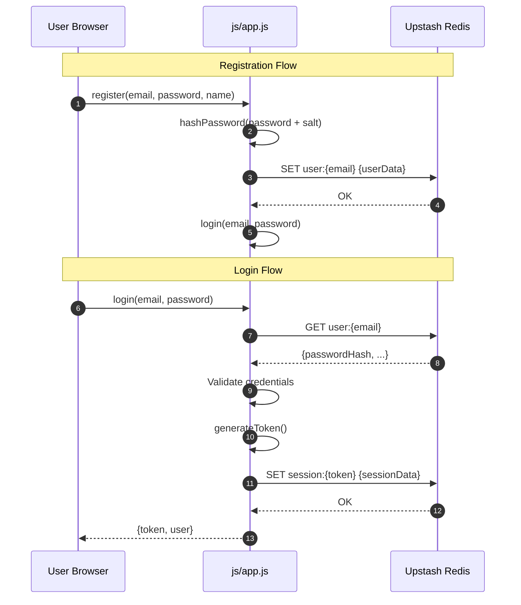
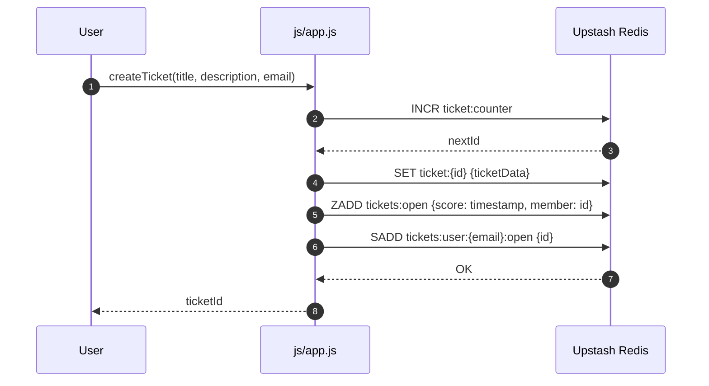
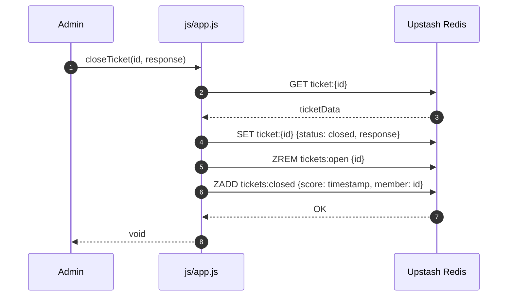

# 🎫 WTicket - Enterprise Ticket Management System

> A modern, scalable ticket management system engineered with vanilla JavaScript and Upstash Redis, designed for zero-infrastructure deployment on static hosting platforms.

[](https://opensource.org/licenses/MIT)
[](https://pages.github.com/)
[](https://upstash.com/)
[](https://web.dev/progressive-web-apps/)
[](https://eslint.org/)
[](https://owasp.org/)

---

## 📋 Project Overview

WTicket is an enterprise-grade, serverless ticket management system architected for rapid deployment without infrastructure overhead. The solution leverages Upstash Redis for persistent, serverless data storage and CDN-distributed static assets for optimal global performance.

### Core Objectives

| Objective | Implementation |
|-----------|----------------|
| **Zero Infrastructure** | Deploy on any static hosting provider (GitHub Pages, Netlify, Vercel) |
| **Cost Efficiency** | Serverless Redis with pay-per-request pricing |
| **Developer Experience** | No build process, instant setup, hot-reload capable |
| **Security First** | SHA-256 hashing, cryptographically secure sessions, XSS sanitization |
| **Offline Capability** | Service Worker caching for static assets |

---

## ✨ Key Features

| Feature | Description |
|---------|-------------|
| **Public Dashboard** | Real-time aggregated statistics (open, closed, total tickets, user count) |
| **User Authentication** | Email/password registration and login with secure session tokens |
| **Role-Based Access Control** | Segregated user and administrator panels with authorization enforcement |
| **Complete Ticket Lifecycle** | Create → Open → Attended → Closed workflow |
| **Real-Time Search** | Filter tickets by title or ID across all views |
| **Progressive Web App** | Installable on iOS/Android/Desktop with partial offline support |
| **Responsive Design System** | Mobile-first CSS with adaptive breakpoints |
| **Toast Notification System** | Non-intrusive visual feedback for all user actions |
| **Auto-Refresh Mechanism** | Automatic data synchronization every 30 seconds |

---

## 🛠 Technical Stack

| Layer | Technology | Version | Purpose |
|-------|------------|---------|---------|
| **Frontend** | Vanilla JavaScript (ES6+) | ES2022 | Core application logic |
| **Module System** | ES Modules | Native | Code organization and imports |
| **Styling** | CSS3 Custom Properties | Modern | Design system and theming |
| **Database** | Upstash Redis | Serverless | Persistent data storage |
| **Redis Client** | @upstash/redis | Latest | Type-safe Redis operations |
| **Dependency CDN** | esm.sh | Edge | Zero-config module bundling |
| **Hosting** | GitHub Pages | Static | Global CDN distribution |
| **PWA** | Service Worker API | v3 | Offline caching and installation |

### Architecture Overview

```
┌─────────────────────────────────────────────────────────────────────────────┐
│                           SYSTEM ARCHITECTURE                                │
├─────────────────────────────────────────────────────────────────────────────┤
│                                                                             │
│   ┌───────────────────────────────────────────────────────────────────┐   │
│   │                     CLIENT LAYER (Browser)                         │   │
│   │  ┌─────────────┐  ┌─────────────┐  ┌─────────────┐              │   │
│   │  │ index.html  │  │ login.html  │  │dashboard.html│  admin.html  │   │
│   │  │ (Dashboard) │  │   (Auth)    │  │  (User)     │  (Admin)    │   │
│   │  └─────────────┘  └─────────────┘  └─────────────┘              │   │
│   │                         │                                          │   │
│   │  ┌─────────────────────────────────────────────────────────────┐  │   │
│   │  │              JavaScript Modules                              │  │   │
│   │  │  js/app.js (Redis Client + Auth + Tickets) │ js/toast.js   │  │   │
│   │  └─────────────────────────────────────────────────────────────┘  │   │
│   └───────────────────────────────────────────────────────────────────┘   │
│                                    │ HTTPS/REST                            │
│                                    ▼                                      │
│   ┌───────────────────────────────────────────────────────────────────┐   │
│   │                    DATA LAYER (Upstash Redis)                      │   │
│   │  ┌──────────────┐  ┌──────────────┐  ┌──────────────┐          │   │
│   │  │   Sessions    │  │    Users     │  │    Tickets   │          │   │
│   │  │ session:{id} │  │ user:{email} │  │  ticket:{id} │          │   │
│   │  └──────────────┘  └──────────────┘  └──────────────┘          │   │
│   └───────────────────────────────────────────────────────────────────┘   │
│                                                                             │
└─────────────────────────────────────────────────────────────────────────────┘
```

---

## 📁 Project Structure

```
wticket/
│
├── index.html                  # Public dashboard - statistics without authentication
├── login.html                 # Authentication - login/register tabs
├── dashboard.html             # User panel - open/closed ticket columns
├── admin.html                 # Administrator panel - ticket management
│
├── manifest.json              # PWA manifest - app metadata and icons
├── service-worker.js          # Service Worker - offline caching strategy
│
├── css/
│   └── styles.css            # Complete design system with CSS custom properties
│
├── js/
│   ├── app.js                # Core API module - Redis operations, auth, ticket CRUD
│   └── toast.js              # Toast notification system with animations
│
├── example_base/              # Reference implementations
│   └── example.js            # Original Upstash Redis connection example
│
├── .github/                   # GitHub configuration
│   └── workflows/            # CI/CD pipelines (if configured)
│
├── LICENSE                    # MIT License
└── README.md                  # This documentation
```

---

## 🔄 System Workflow

### Authentication Flow



### Ticket Creation Flow



### Admin Resolution Flow



---

## 🚀 Installation & Setup

### Prerequisites

| Requirement | Specification |
|-------------|----------------|
| Browser | Chrome 90+, Firefox 88+, Safari 14+, Edge 90+ |
| Network | Internet connectivity (Redis connection) |
| Redis | Upstash account with REST API credentials |
| Git | For version control and deployment |

### Quick Start

```bash
# 1. Clone the repository
git clone https://github.com/wisrovi/wticket.git
cd wticket

# 2. Configure Redis credentials
# Edit js/app.js with your Redis URL and token
```

```javascript
// js/app.js - Configuration section
const REDIS = new Redis({
  url: 'YOUR_UPSTASH_REDIS_URL',    // e.g., https://xxx.upstash.io
  token: 'YOUR_UPSTASH_TOKEN',      // Your authentication token
});
```

```bash
# 3. Local development server (optional but recommended)
python3 -m http.server 8000

# 4. Deploy to GitHub Pages
# Push to your repository and enable Pages in Settings
```

---

## ⚙️ Configuration

### Application Constants

```javascript
// js/app.js - Application configuration
const ADMIN_EMAIL = 'wisrovi@wticket.com';    // Default admin email
const ADMIN_PASSWORD = 'wisrovi_wticket';     // Default admin password
const SESSION_DURATION = 24 * 60 * 60 * 1000; // 24 hours in milliseconds
```

---

## 📖 Usage Guide

### User Flow

1. **Access Dashboard** → View public statistics without login
2. **Register** → Create account with email and password
3. **Login** → Authenticate with credentials
4. **Create Ticket** → Submit title and optional description
5. **Track Tickets** → Monitor open tickets in real-time
6. **View Resolution** → Check closed tickets with responses

### Administrator Flow

1. **Login** → Use admin credentials
2. **View Stats** → Monitor system-wide ticket metrics
3. **Browse Open Tickets** → Ordered by creation date (oldest first)
4. **Search Tickets** → Find by title or ID
5. **Resolve Tickets** → Add optional response and close
6. **Review Closed** → Access history of resolved tickets

---

## 📊 Redis Data Schema

```
┌─────────────────────────────────────────────────────────────────────────────┐
│                           REDIS KEY STRUCTURE                                │
├─────────────────────────────────────────────────────────────────────────────┤
│                                                                             │
│  ticket:counter                    Integer                                  │
│  └── Auto-incrementing unique ticket identifier                            │
│                                                                             │
│  ticket:{id}                       JSON String                             │
│  ├── id: Integer                  Primary key                             │
│  ├── title: String                Ticket subject (XSS sanitized)          │
│  ├── description: String          Optional details                         │
│  ├── userEmail: String            Ticket creator's email                  │
│  ├── status: String               "open" | "closed"                       │
│  ├── createdAt: Integer           Unix timestamp (milliseconds)           │
│  ├── response: String             Admin response text                     │
│  └── responseAt: Integer          Resolution timestamp                     │
│                                                                             │
│  tickets:open                      Sorted Set                              │
│  └── Score: Unix timestamp, Member: ticket ID                             │
│                                                                             │
│  tickets:closed                    Sorted Set                              │
│  └── Score: Unix timestamp, Member: ticket ID                             │
│                                                                             │
│  tickets:user:{email}:open        Set                                     │
│  └── User's open ticket IDs                                            │
│                                                                             │
│  tickets:user:{email}:closed      Set                                     │
│  └── User's closed ticket IDs                                           │
│                                                                             │
│  user:{email}                     JSON String                              │
│  ├── email: String                Unique identifier                        │
│  ├── passwordHash: String         SHA-256 hash with salt                  │
│  ├── name: String                 Display name                            │
│  ├── role: String                 "user" | "admin"                        │
│  └── createdAt: Integer          Registration timestamp                   │
│                                                                             │
│  session:{token}                  JSON String (TTL: 24h)                    │
│  ├── email: String                Associated user email                    │
│  ├── name: String                 Cached display name                     │
│  ├── role: String                 Cached user role                         │
│  ├── createdAt: Integer           Session creation timestamp               │
│  └── expiresAt: Integer           Session expiry timestamp                 │
│                                                                             │
└─────────────────────────────────────────────────────────────────────────────┘
```

---

## 🔒 Security Architecture

### Implemented Security Controls

| Control | Implementation | Effectiveness |
|---------|---------------|---------------|
| **Password Hashing** | SHA-256 with application salt | High |
| **Session Tokens** | 256-bit cryptographically random | High |
| **Session Expiry** | 24-hour automatic TTL | Medium |
| **XSS Prevention** | HTML entity escaping | High |
| **Input Sanitization** | Client-side validation | Medium |

---

## 🤝 Contributing

1. Fork the repository
2. Create a feature branch (`git checkout -b feature/amazing-feature`)
3. Commit changes (`git commit -m 'Add amazing feature'`)
4. Push to branch (`git push origin feature/amazing-feature`)
5. Open a Pull Request

---

## 📄 License

This project is licensed under the MIT License - see the [LICENSE](LICENSE) file for details.

---

<p align="center">
  <strong>🎫 WTicket</strong> — Enterprise ticket management, zero infrastructure.
</p>
