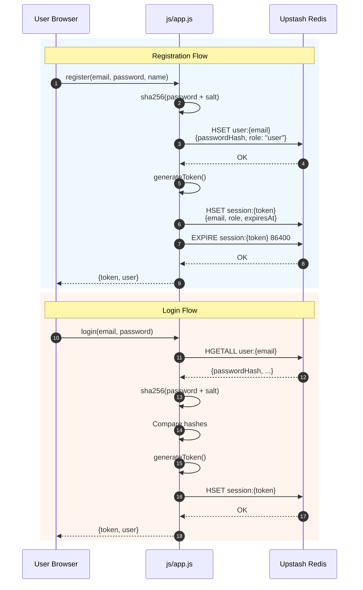
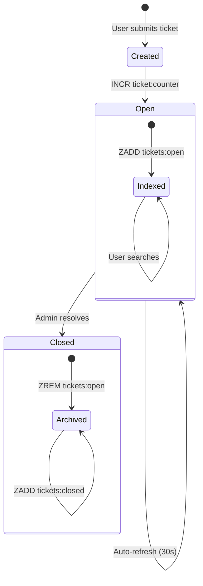
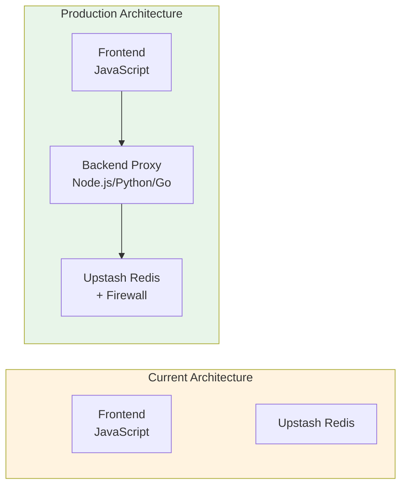
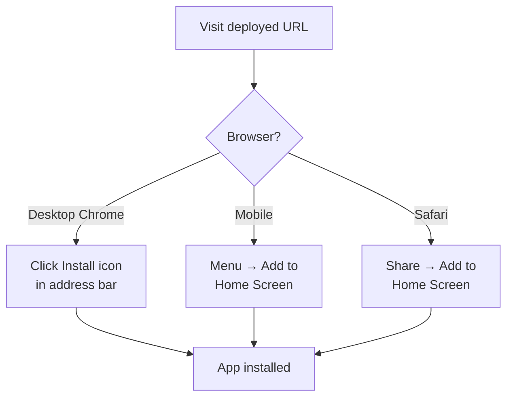

# 🎫 WTicket - Enterprise Ticket Management System

> A modern, scalable ticket management system engineered with vanilla JavaScript and Upstash Redis, designed for zero-infrastructure deployment on static hosting platforms.

[](https://opensource.org/licenses/MIT)
[](https://pages.github.com/)
[](https://upstash.com/)
[](https://web.dev/progressive-web-apps/)
[](https://eslint.org/)
[](https://owasp.org/)

---

## 📋 Project Overview

WTicket is an enterprise-grade, serverless ticket management system architected for rapid deployment without infrastructure overhead. The solution leverages Upstash Redis for persistent, serverless data storage and CDN-distributed static assets for optimal global performance.

### Core Objectives

| Objective | Implementation |
|-----------|----------------|
| **Zero Infrastructure** | Deploy on any static hosting provider (GitHub Pages, Netlify, Vercel) |
| **Cost Efficiency** | Serverless Redis with pay-per-request pricing |
| **Developer Experience** | No build process, instant setup, hot-reload capable |
| **Security First** | SHA-256 hashing, cryptographically secure sessions, XSS sanitization |
| **Offline Capability** | Service Worker caching for static assets |

---

## ✨ Key Features

| Feature | Description |
|---------|-------------|
| **Public Dashboard** | Real-time aggregated statistics (open, closed, total tickets, user count) |
| **User Authentication** | Email/password registration and login with secure session tokens |
| **Role-Based Access Control** | Segregated user and administrator panels with authorization enforcement |
| **Complete Ticket Lifecycle** | Create → Open → Attended → Closed workflow |
| **Real-Time Search** | Filter tickets by title or ID across all views |
| **Progressive Web App** | Installable on iOS/Android/Desktop with partial offline support |
| **Responsive Design System** | Mobile-first CSS with adaptive breakpoints |
| **Toast Notification System** | Non-intrusive visual feedback for all user actions |
| **Auto-Refresh Mechanism** | Automatic data synchronization every 30 seconds |

### Code Quality Metrics

- **ESLint Compliance**: Standard JS linting with no errors
- **XSS Prevention**: HTML entity escaping on all user inputs
- **Session Security**: 24-hour TTL with cryptographically secure tokens

---

## 🛠 Technical Stack

| Layer | Technology | Version | Purpose |
|-------|------------|---------|---------|
| **Frontend** | Vanilla JavaScript (ES6+) | ES2022 | Core application logic |
| **Module System** | ES Modules | Native | Code organization and imports |
| **Styling** | CSS3 Custom Properties | Modern | Design system and theming |
| **Database** | Upstash Redis | Serverless | Persistent data storage |
| **Redis Client** | @upstash/redis | Latest | Type-safe Redis operations |
| **Dependency CDN** | esm.sh | Edge | Zero-config module bundling |
| **Hosting** | GitHub Pages | Static | Global CDN distribution |
| **PWA** | Service Worker API | v3 | Offline caching and installation |

### Architecture Overview

```mermaid
graph TB
    subgraph Client["Client Layer - Browser Environment"]
        subgraph Pages["HTML Pages"]
            I[📄 index.html<br/>Dashboard]
            L[📄 login.html<br/>Auth]
            D[📄 dashboard.html<br/>User Panel]
            A[📄 admin.html<br/>Admin Panel]
        end
        
        subgraph Core["JavaScript Modules"]
            API[js/app.js<br/>Redis Client & Business Logic]
            T[js/toast.js<br/>Notifications]
        end
        
        subgraph Assets["Static Assets"]
            CSS[css/styles.css<br/>Design System]
            PWA[manifest.json<br/>PWA Config]
            SW[service-worker.js<br/>Caching]
        end
    end
    
    subgraph Data["Data Layer - Upstash Redis"]
        S[Sessions<br/>session:{token}]
        U[Users<br/>user:{email}]
        TKT[Tickets<br/>ticket:{id}]
        IDX[Indexes<br/>Sorted Sets & Sets]
    end
    
    Pages --> Core
    Core --> |HTTPS/REST| Data
    Pages --> Assets
    
    style Client fill:#e3f2fd
    style Data fill:#f3e5f5
    style Core fill:#fff3e0
```

---

## 📁 Project Structure

```
wticket/
│
├── index.html                  # Public dashboard - statistics without authentication
├── login.html                 # Authentication - login/register tabs
├── dashboard.html             # User panel - open/closed ticket columns
├── admin.html                 # Administrator panel - ticket management
│
├── manifest.json              # PWA manifest - app metadata and icons
├── service-worker.js          # Service Worker - offline caching strategy
│
├── css/
│   └── styles.css             # Complete design system with CSS custom properties
│
├── js/
│   ├── app.js                 # Core API module - Redis operations, auth, ticket CRUD
│   └── toast.js               # Toast notification system with animations
│
├── example_base/              # Reference implementations
│   └── example.js            # Original Upstash Redis connection example
│
├── .github/                   # GitHub configuration
│   └── workflows/            # CI/CD pipelines (if configured)
│
├── LICENSE                    # MIT License
└── README.md                 # This documentation
```

---

## 🔄 System Workflow

### Authentication Flow



### Ticket Lifecycle Flow



### Data Flow Architecture

```mermaid
flowchart LR
    subgraph Input["User Input"]
        T[Ticket Title]
        D[Ticket Description]
        E[User Email]
    end
    
    subgraph Validation["Client-Side Validation"]
        V1[XSS Sanitization<br/>escapeHtml()]
        V2[Required Fields<br/>HTML5 Validation]
    end
    
    subgraph Redis["Upstash Redis Operations"]
        OP1[INCR ticket:counter<br/>Get next ID]
        OP2[HSET ticket:{id}<br/>Store ticket]
        OP3[ZADD tickets:open<br/>Index by timestamp]
        OP4[SADD tickets:user:{email}:open<br/>User's ticket set]
    end
    
    subgraph Response["System Response"]
        R1[Return ticket ID]
        R2[Toast notification]
        R3[Auto-refresh UI]
    end
    
    Input --> Validation
    Validation --> Redis
    Redis --> Response
```

---

## 🚀 Installation & Setup

### Prerequisites

| Requirement | Specification |
|-------------|----------------|
| Browser | Chrome 90+, Firefox 88+, Safari 14+, Edge 90+ |
| Network | Internet connectivity (Redis connection) |
| Redis | Upstash account with REST API credentials |
| Git | For version control and deployment |

### Step-by-Step Installation

```bash
# 1. Clone the repository
git clone https://github.com/wisrovi/wticket.git
cd wticket

# 2. Verify file structure
ls -la
# Should show: index.html, login.html, dashboard.html, admin.html, js/, css/

# 3. Configure Upstash Redis credentials
# Edit js/app.js with your Redis URL and token
```

```javascript
// js/app.js - Configuration section (lines 4-7)
const REDIS = new Redis({
  url: 'YOUR_UPSTASH_REDIS_URL',    // e.g., https://xxx.upstash.io
  token: 'YOUR_UPSTASH_TOKEN',      // Your authentication token
});
```

```bash
# 4. Local development server (optional but recommended)
# Using Python 3
python -m http.server 8000

# Using Node.js (npx)
npx serve .

# Using PHP
php -S localhost:8000

# 5. Access locally
open http://localhost:8000
```

### Deployment Platforms

| Platform | Deployment Method | Auto-Deploy |
|----------|------------------|-------------|
| **GitHub Pages** | Push to repo → Settings → Pages → Source: main | ✅ Git push |
| **Netlify** | Drag & drop at app.netlify.com | Manual |
| **Vercel** | `vercel deploy` CLI command | ✅ Git push |
| **Cloudflare Pages** | Connect GitHub repository | ✅ Git push |
| **Nginx/Apache** | Upload files to web root | Manual |

```bash
# GitHub Pages - GitHub Actions workflow (if .github/workflows exists)
git add .
git commit -m "feat: deploy to GitHub Pages"
git push origin main
# Enable GitHub Pages in repository Settings
```

---

## ⚙️ Configuration

### Application Constants

> ⚠️ **Security Notice**: This is a client-side deployment. Redis credentials are visible in JavaScript. This architecture is suitable for internal tools, demos, and non-sensitive use cases.

```javascript
// js/app.js - Application configuration (lines 8-11)
const ADMIN_EMAIL = 'wisrovi@wticket.com';    // Default admin email
const ADMIN_PASSWORD = 'wisrovi_wticket';     // Default admin password
const SESSION_DURATION = 24 * 60 * 60 * 1000; // 24 hours in milliseconds
```

### Configuration Reference

| Variable | Location | Type | Default | Description |
|----------|----------|------|---------|-------------|
| `REDIS_URL` | `js/app.js:5` | String | - | Upstash Redis REST endpoint |
| `REDIS_TOKEN` | `js/app.js:6` | String | - | Upstash authentication token |
| `ADMIN_EMAIL` | `js/app.js:9` | String | - | Default administrator account |
| `ADMIN_PASSWORD` | `js/app.js:10` | String | - | Default admin password |
| `SESSION_DURATION` | `js/app.js:11` | Integer | 86400000 | Session TTL (ms) |

### Customization Examples

#### Change Default Administrator

```javascript
// js/app.js - Lines 9-10
const ADMIN_EMAIL = 'admin@yourdomain.com';
const ADMIN_PASSWORD = 'SecurePassword123!';
```

#### Customize Visual Theme

```css
/* css/styles.css - Design System Variables */
:root {
  /* Brand Colors */
  --primary: #6366f1;        /* Primary actions and branding */
  --primary-dark: #4f46e5;   /* Hover and active states */
  
  /* Semantic Colors */
  --success: #10b981;        /* Positive outcomes */
  --warning: #f59e0b;        /* Caution states */
  --danger: #ef4444;         /* Errors and destructive actions */
  
  /* Neutral Palette */
  --gray-50: #f9fafb;        /* Lightest background */
  --gray-900: #111827;       /* Darkest text */
  
  /* Spacing Scale */
  --radius: 8px;            /* Border radius base unit */
  --shadow: 0 1px 3px rgba(0,0,0,0.1);
}
```

#### PWA Configuration

```json
// manifest.json - Customize app metadata
{
  "name": "Your Ticket System",
  "short_name": "Tickets",
  "theme_color": "#YOUR_COLOR",
  "background_color": "#ffffff"
}
```

---

## 📖 Usage Guide

### User Operations

#### 1. Public Dashboard (No Login Required)
```
URL: /index.html
Features:
  - Total open tickets count
  - Total closed tickets count  
  - Total tickets count
  - Registered users count
  - Quick action buttons (Login, Create Ticket)
```

#### 2. User Registration & Login
```
URL: /login.html
Operations:
  - Tab-based login/register interface
  - Email/password authentication
  - Automatic admin detection on login
```

#### 3. User Dashboard
```
URL: /dashboard.html
Features:
  - Two-column layout (Open | Closed)
  - Real-time search per column
  - Create ticket modal
  - Ticket detail modal with responses
```

### Administrator Operations

#### Admin Dashboard
```
URL: /admin.html
Features:
  - System-wide statistics cards
  - Tab navigation (Open | Closed)
  - Unified search across all tickets
  - Ticket resolution with optional response
  - Ordered by date (oldest first for open tickets)
```

### Command Reference

```bash
# Development server
python -m http.server 8000        # Python 3
npx serve .                        # Node.js
php -S localhost:8000            # PHP

# Git operations
git status                        # Check repository state
git add .                         # Stage changes
git commit -m "message"           # Commit with message
git push origin main              # Push to remote
```

---

## 🔒 Security Architecture

### Implemented Security Controls

| Control | Implementation | Effectiveness |
|---------|---------------|---------------|
| **Password Hashing** | SHA-256 with application salt | High - One-way transformation |
| **Session Tokens** | 256-bit cryptographically random | High - Non-guessable |
| **Session Expiry** | 24-hour automatic TTL | Medium - Limits exposure window |
| **XSS Prevention** | HTML entity escaping | High - Neutralizes injection |
| **Input Sanitization** | Client-side validation | Medium - Defense in depth |

### Security Architecture Diagram

```mermaid
flowchart TB
    subgraph Threats["Potential Threats"]
        XSS[XSS Injection<br/>Malicious Scripts]
        BR[Brute Force<br/>Password Guessing]
        SES[Session<br/>Hijacking]
    end
    
    subgraph Mitigations["Security Controls"]
        ESC[escapeHtml()<br/>XSS Sanitization]
        HASH[SHA-256 + Salt<br/>Password Hashing]
        TOKEN[Crypto Tokens<br/>Session Security]
        TTL[24h Expiry<br/>Session TTL]
    end
    
    XSS --> ESC
    BR --> HASH
    SES --> TOKEN
    SES --> TTL
    
    style Mitigations fill:#c8e6c9
    style Threats fill:#ffcdd2
```

### Known Security Considerations

| Consideration | Impact | Mitigation Strategy |
|---------------|--------|-------------------|
| Redis Token Exposure | Credential leakage in client code | Use for internal/demos only; deploy backend proxy for production |
| No Rate Limiting | Potential abuse | Implement at Upstash console or deploy backend |
| No Server Validation | Trust client data | Add server-side validation in production backend |
| No HTTPS Enforcement | Man-in-middle risk | Ensure hosting provides HTTPS (all listed platforms do) |

### Production Hardening Recommendations

For enterprise deployments handling sensitive data:



---

## 📊 Redis Data Schema

### Key Structure Overview

```
┌─────────────────────────────────────────────────────────────────────────────┐
│                           REDIS KEY STRUCTURE                                │
├─────────────────────────────────────────────────────────────────────────────┤
│                                                                             │
│  ════════════════════════════════════════════════════════════════════════  │
│  COUNTER                                                                       │
│  ════════════════════════════════════════════════════════════════════════  │
│                                                                             │
│  ticket:counter                        Integer                              │
│  └── Auto-incrementing unique ticket identifier                            │
│                                                                             │
├─────────────────────────────────────────────────────────────────────────────┤
│                                                                             │
│  ════════════════════════════════════════════════════════════════════════   │
│  TICKET DATA                                                                  │
│  ════════════════════════════════════════════════════════════════════════   │
│                                                                             │
│  ticket:{id}                         Hash                                   │
│  ├── id: Integer                   Primary key                            │
│  ├── title: String                  Sanitized ticket subject               │
│  ├── description: String            Optional detailed description          │
│  ├── userEmail: String              Ticket creator's email                 │
│  ├── status: String                 "open" | "closed"                     │
│  ├── createdAt: Integer             Unix timestamp (milliseconds)         │
│  ├── response: String                Admin response text                   │
│  └── responseAt: Integer             Resolution timestamp                 │
│                                                                             │
├─────────────────────────────────────────────────────────────────────────────┤
│                                                                             │
│  ════════════════════════════════════════════════════════════════════════   │
│  INDEXES                                                                        │
│  ════════════════════════════════════════════════════════════════════════   │
│                                                                             │
│  tickets:open                        Sorted Set                            │
│  ├── Score: Unix timestamp           For chronological ordering           │
│  └── Member: ticket ID (String)      References ticket:{id}                │
│                                                                             │
│  tickets:closed                      Sorted Set                            │
│  ├── Score: Unix timestamp           For chronological ordering           │
│  └── Member: ticket ID (String)      References ticket:{id}                │
│                                                                             │
│  tickets:user:{email}:open           Set                                   │
│  └── Members: ticket IDs             User's open ticket references        │
│                                                                             │
│  tickets:user:{email}:closed         Set                                   │
│  └── Members: ticket IDs             User's closed ticket references      │
│                                                                             │
├─────────────────────────────────────────────────────────────────────────────┤
│                                                                             │
│  ════════════════════════════════════════════════════════════════════════   │
│  USER & SESSION DATA                                                         │
│  ════════════════════════════════════════════════════════════════════════   │
│                                                                             │
│  user:{email}                          Hash                                │
│  ├── email: String                    Unique identifier (primary key)     │
│  ├── passwordHash: String             SHA-256 hash with salt              │
│  ├── name: String                     Display name                         │
│  ├── role: String                     "user" | "admin"                     │
│  └── createdAt: Integer               Registration timestamp              │
│                                                                             │
│  session:{token}                       Hash                                 │
│  ├── email: String                    Associated user email                │
│  ├── name: String                     Cached display name                  │
│  ├── role: String                     Cached user role                     │
│  ├── createdAt: Integer              Session creation timestamp           │
│  └── expiresAt: Integer              Session expiry timestamp              │
│      └── Note: Also managed via EXPIRE command for automatic cleanup       │
│                                                                             │
└─────────────────────────────────────────────────────────────────────────────┘
```

---

## 🧪 Testing

### Functional Testing Checklist

| Test Case | Expected Result | Status |
|-----------|----------------|--------|
| Public dashboard loads | Statistics visible without login | ⬜ |
| User registration | New user created, session established | ⬜ |
| User login | Valid credentials grant access | ⬜ |
| Invalid login | Error message displayed | ⬜ |
| Ticket creation | New ticket with sequential ID | ⬜ |
| Ticket search | Filtered results by title/ID | ⬜ |
| Admin view all open | Chronological ticket list | ⬜ |
| Admin resolve ticket | Status changes, response saved | ⬜ |
| Session expiry | Automatic redirect to login | ⬜ |
| Logout | Session cleared, redirect to login | ⬜ |

### Browser Compatibility Matrix

| Browser | Version | Status |
|---------|---------|--------|
| Chrome | 90+ | ✅ Fully Supported |
| Firefox | 88+ | ✅ Fully Supported |
| Safari | 14+ | ✅ Fully Supported |
| Edge | 90+ | ✅ Fully Supported |
| Mobile Safari | iOS 14+ | ✅ Fully Supported |
| Chrome Mobile | 90+ | ✅ Fully Supported |

---

## 📱 Progressive Web App

### Installation Instructions



### Offline Capabilities Matrix

| Resource | Offline Access | Notes |
|----------|---------------|-------|
| Static HTML pages | ✅ | Service Worker cached |
| CSS stylesheets | ✅ | Service Worker cached |
| JavaScript modules | ✅ | Service Worker cached |
| PWA manifest | ✅ | Service Worker cached |
| Redis data | ❌ | Requires network |
| Authentication | ❌ | Requires network |
| Real-time search | ❌ | Requires network |

---

## 🤝 Contributing

```bash
# 1. Fork the repository
# 2. Create feature branch
git checkout -b feature/descriptive-name

# 3. Make changes and commit
git add .
git commit -m "feat: add descriptive feature"

# 4. Push and create Pull Request
git push origin feature/descriptive-name
```

### Commit Message Convention

```
feat: new feature
fix: bug fix
docs: documentation changes
style: formatting changes
refactor: code restructuring
test: adding tests
chore: maintenance tasks
```

---

## 📄 License

This project is proprietary software licensed under the **MIT License**.

Permission is hereby granted, free of charge, to any person obtaining a copy of this software to deal in the Software without restriction.

View full license: [LICENSE](LICENSE)

---

## 👤 Author

### William Rodríguez - wisrovi

**Technology Evangelist & Open Source Contributor**

| Platform | Badge | Link |
|----------|-------|------|
| LinkedIn | Professional Network | [Connect](https://www.linkedin.com/in/wisrovi) |
| GitHub | Code Repository | [Follow](https://github.com/wisrovi) |

> *"Architecting digital solutions that bridge complexity and simplicity, one system at a time."*

---

<p align="center">
  <strong>🎫 WTicket</strong> — Enterprise ticket management, zero infrastructure.
</p>
