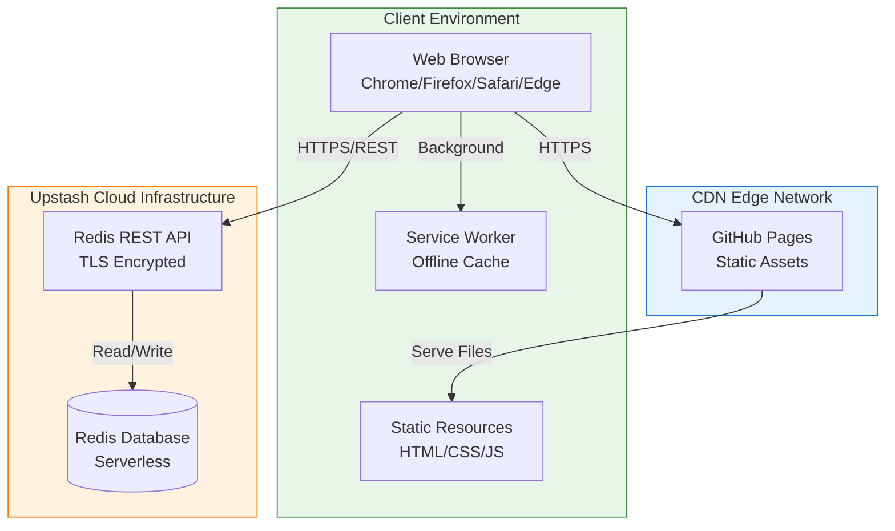
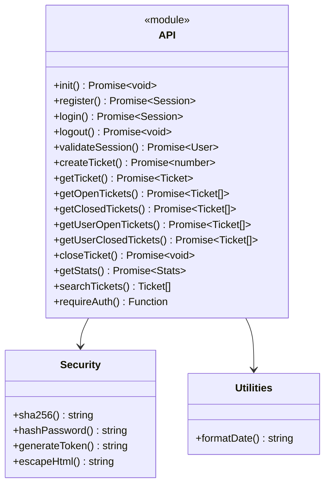
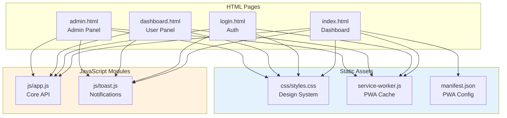
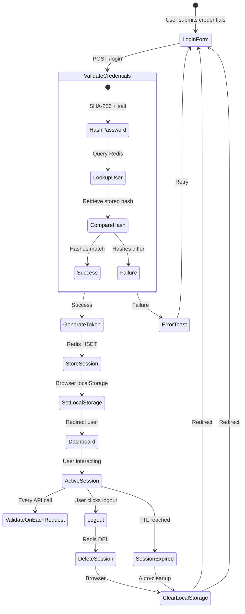
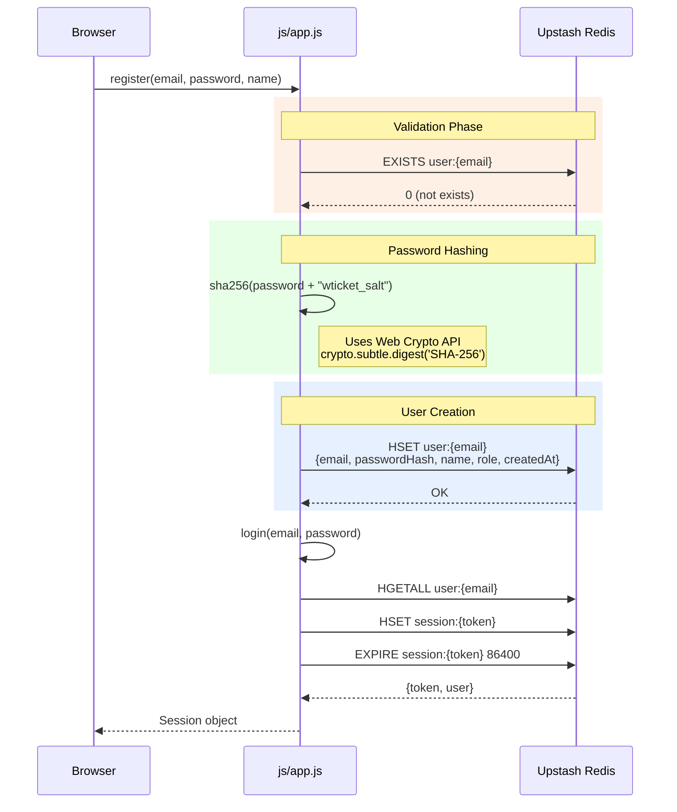
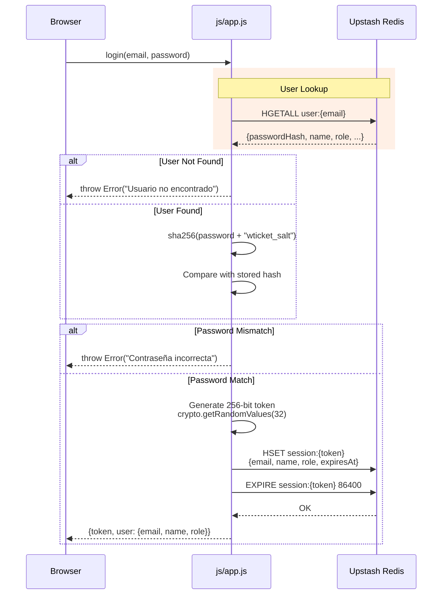
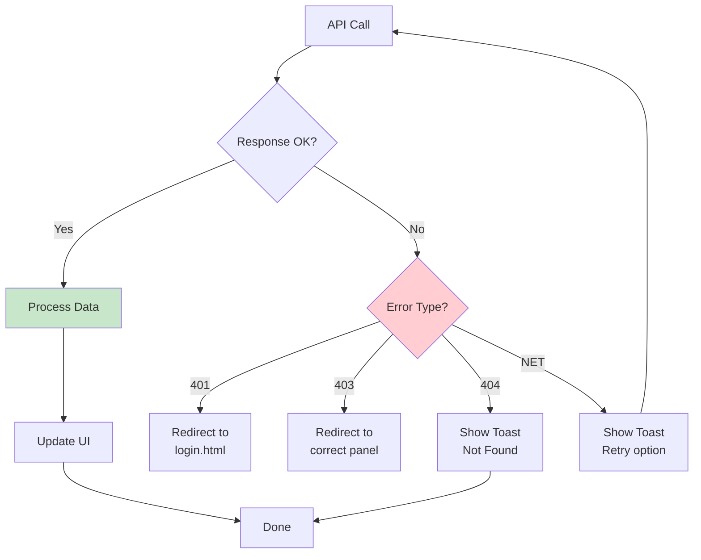

# Architecture & Backend Core Documentation

> **Technical Reference**: This document provides a comprehensive architectural overview of the serverless ticket management microservice.

---

## 1. Architectural Overview

### 1.1 System Classification

| Attribute | Value |
|-----------|-------|
| **Architecture Pattern** | Serverless Frontend + Cloud Database |
| **Deployment Model** | Static Site Generation (SSG) |
| **Data Layer** | Serverless Redis (Upstash) |
| **Frontend Paradigm** | Single Page Application (SPA) - Multi-page variant |
| **Authentication Model** | Token-based Session Management |

### 1.2 High-Level Architecture



### 1.3 Design Principles

1. **Zero Server Principle**: No application server required; all logic executes in browser context
2. **Stateless Client Pattern**: Client maintains no persistent state; Redis is single source of truth
3. **Edge-First Delivery**: Static assets served from CDN for global low-latency access
4. **Progressive Enhancement**: Core functionality works without JavaScript; enhanced with JS modules

---

## 2. Backend Core Components

### 2.1 Data Layer - Upstash Redis

| Component | Specification |
|-----------|----------------|
| **Provider** | Upstash Inc. |
| **Protocol** | REST API over HTTPS |
| **Authentication** | Token-based (Bearer token in header) |
| **Pricing Model** | Pay-per-request (Serverless) |
| **Geo-replication** | Multi-region by default |
| **Persistence** | In-memory with optional persistence |

### 2.2 Redis Data Types Utilization

```mermaid
classDiagram
    class RedisConnection {
        <<singleton>>
        -url: string
        -token: string
        +get(key) Promise~any~
        +set(key, value) Promise~void~
        +hgetall(key) Promise~object~
        +hset(key, data) Promise~number~
        +zadd(key, data) Promise~number~
        +sadd(key, member) Promise~number~
        +incr(key) Promise~number~
    }
    
    class TicketCounter {
        +getNextId() number
    }
    
    class TicketHash {
        +id: number
        +title: string
        +description: string
        +userEmail: string
        +status: "open"|"closed"
        +createdAt: number
        +response: string
        +responseAt: number
    }
    
    class SessionHash {
        +email: string
        +name: string
        +role: string
        +createdAt: number
        +expiresAt: number
    }
    
    class UserHash {
        +email: string
        +passwordHash: string
        +name: string
        +role: string
        +createdAt: number
    }
    
    class SortedSet {
        +tickets:open
        +tickets:closed
        Score: Unix timestamp
        Member: ticket ID
    }
    
    class Set {
        +tickets:user:{email}:open
        +tickets:user:{email}:closed
        Members: ticket IDs
    }
    
    RedisConnection --> TicketCounter
    RedisConnection --> TicketHash
    RedisConnection --> SessionHash
    RedisConnection --> UserHash
    RedisConnection --> SortedSet
    RedisConnection --> Set
```

### 2.3 API Module Structure (js/app.js)



---

## 3. Frontend Core Components

### 3.1 Page Structure

| Page | Route | Purpose | Auth Required |
|------|-------|--------|---------------|
| **index.html** | `/` | Public dashboard, statistics | No |
| **login.html** | `/login.html` | Authentication (login/register) | No (redirects if authenticated) |
| **dashboard.html** | `/dashboard.html` | User panel (my tickets) | Yes (user role) |
| **admin.html** | `/admin.html` | Admin panel (manage all) | Yes (admin role) |

### 3.2 Module Dependency Graph



---

## 4. Session Management Architecture

### 4.1 Token Lifecycle



### 4.2 Session Storage Schema

```
session:{token} (Hash)
├── email: String        # User's email address
├── name: String         # Cached display name
├── role: String         # "user" | "admin"
├── createdAt: Integer    # Unix timestamp (ms)
└── expiresAt: Integer    # TTL timestamp (ms)
    └── EXPIRE: 86400 seconds (24 hours)
```

---

## 5. Authentication Flow

### 5.1 Registration Sequence



### 5.2 Login Sequence



---

## 6. Error Handling Strategy

### 6.1 Error Categories

| Category | Code | Handling |
|----------|------|----------|
| **Validation** | 400 | Client-side HTML5 + JS validation |
| **Authentication** | 401 | Redirect to login.html |
| **Authorization** | 403 | Redirect to appropriate panel |
| **Not Found** | 404 | Toast notification + graceful fallback |
| **Server Error** | 500 | Toast error message |
| **Network Error** | NET | Toast "Connection error" + retry |

### 6.2 Error Flow Diagram



---

## 7. Performance Characteristics

### 7.1 Latency Benchmarks

| Operation | Typical Latency | Notes |
|-----------|----------------|-------|
| **Page Load (cached)** | 50-200ms | CDN edge cached |
| **Page Load (uncached)** | 200-500ms | First visit |
| **Redis GET** | 50-150ms | Round trip to Upstash |
| **Redis HSET** | 50-150ms | Write operation |
| **Session Validation** | 100-200ms | Two Redis calls |

### 7.2 Optimization Strategies

1. **Service Worker Caching**: Static assets cached after first load
2. **ES Module CDN**: esm.sh for optimized module delivery
3. **Auto-refresh Throttling**: 30-second intervals prevent excessive API calls
4. **Client-side Filtering**: Search filters run in-browser, not server-side

---

## 8. Scalability Considerations

### 8.1 Horizontal Scaling

Since this is a serverless architecture:
- **No application server to scale**: Static files served from CDN
- **Redis auto-scales**: Upstash handles scaling automatically
- **Stateless clients**: Any browser can connect

### 8.2 Vertical Scaling Limits

| Component | Limit | Mitigation |
|-----------|-------|------------|
| **Ticket count** | Redis memory | Archive old tickets |
| **User count** | Redis memory | Pagination if needed |
| **Search** | Client-side only | Implement server-side search |
| **Session storage** | Redis memory | Session cleanup cron |

---

*Document Version: 1.0*  
*Last Updated: 2026-03-25*
