# Communication Flow Documentation

> **Technical Reference**: This document details all communication patterns, data flows, and integration points of the ticket management microservice.

---

## 1. External Communication Overview

### 1.1 Communication Topology

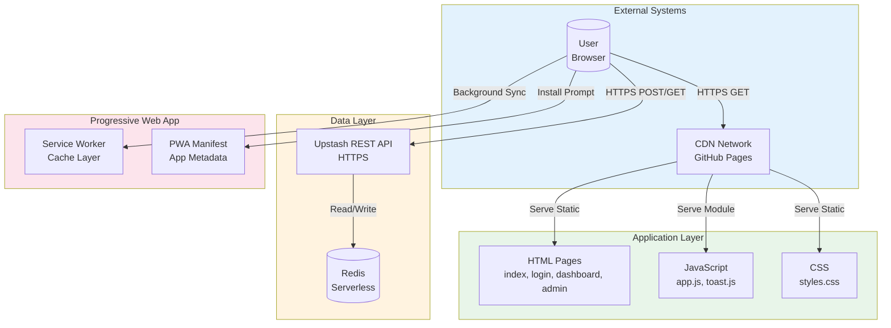

### 1.2 Protocol Summary

| Communication Path | Protocol | Security | Port |
|-------------------|----------|----------|------|
| Browser → CDN | HTTPS | TLS 1.3 | 443 |
| Browser → Upstash | HTTPS | TLS 1.3 | 443 |
| CDN → Browser | HTTPS | TLS 1.3 | 443 |
| Service Worker → Cache | Internal | N/A | N/A |

---

## 2. Internal Module Communication

### 2.1 Module Dependency Flow

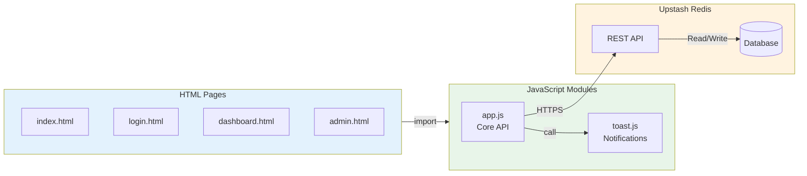

### 2.2 Cross-Module Data Exchange

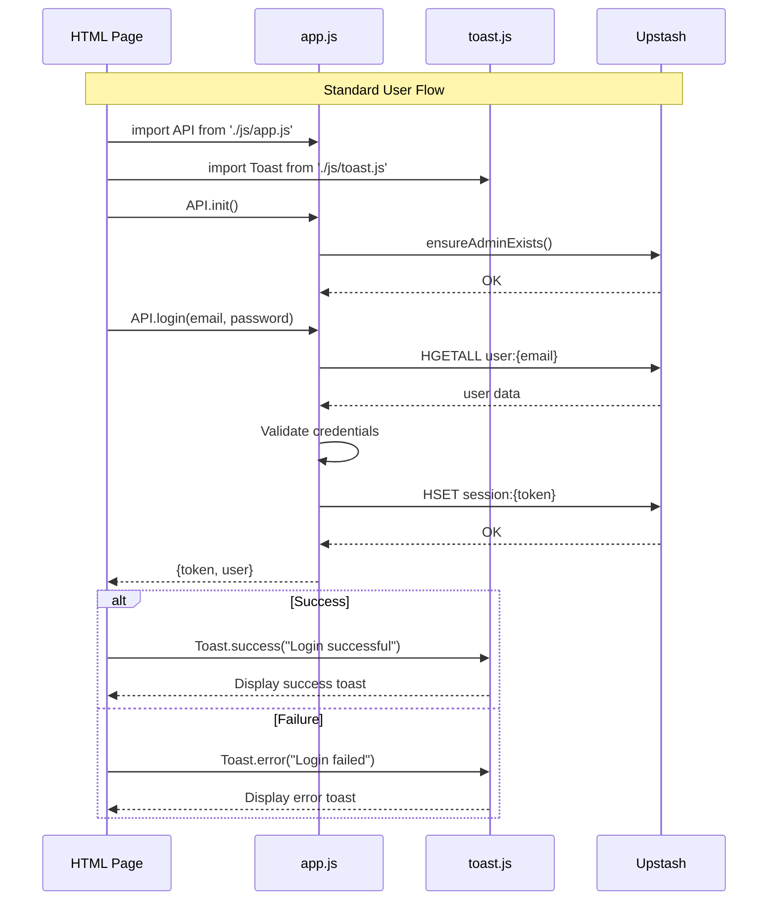

---

## 3. Authentication Communication Patterns

### 3.1 Login/Register Flow

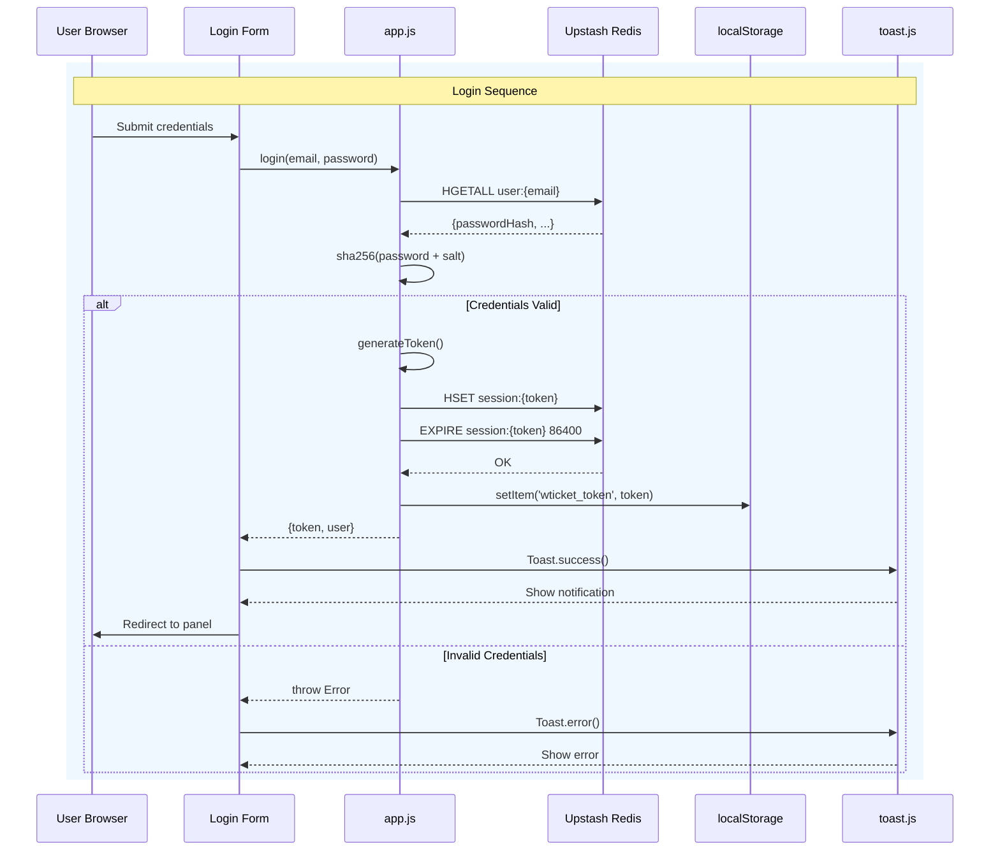

### 3.2 Session Validation Flow

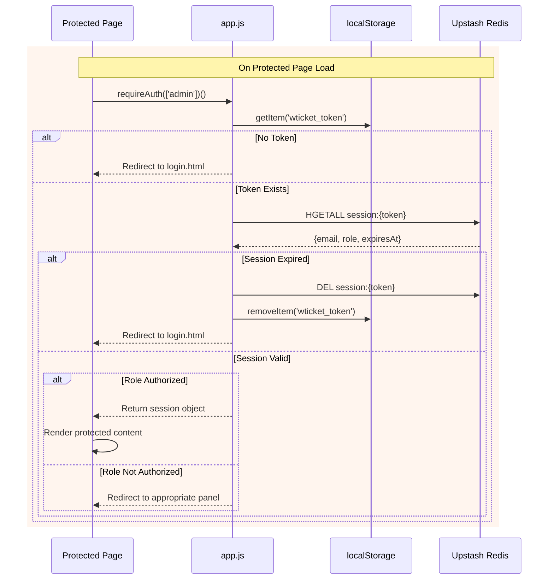

---

## 4. Ticket Operations Communication

### 4.1 Create Ticket Flow

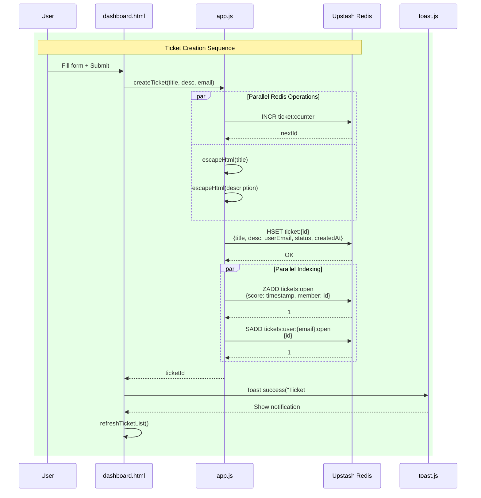

### 4.2 Close Ticket Flow (Admin)

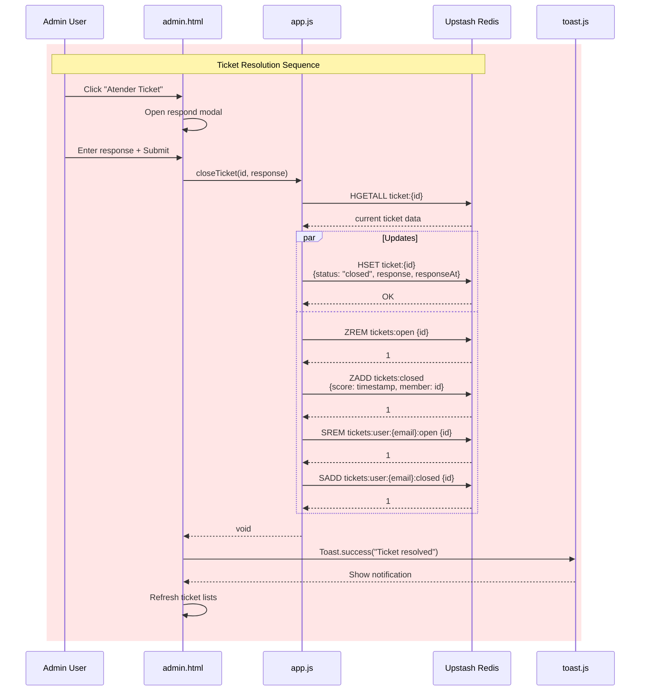

---

## 5. Real-Time Updates Communication

### 5.1 Auto-Refresh Pattern

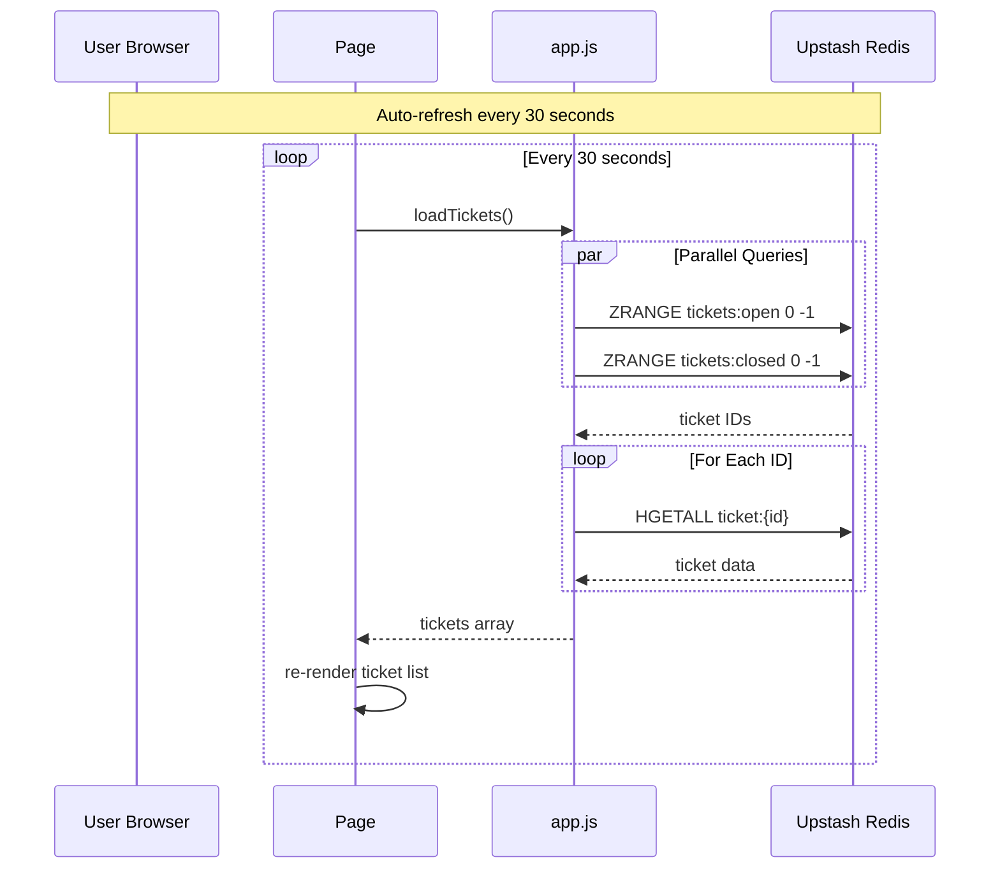

### 5.2 Stats Update Pattern

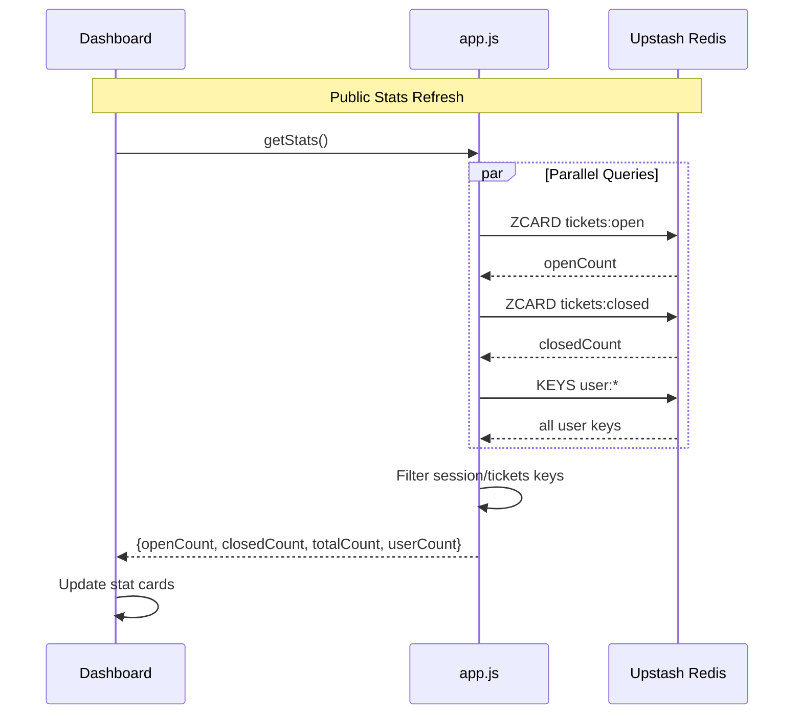

---

## 6. Service Worker Communication

### 6.1 Cache Strategy

```mermaid
flowchart TB
    subgraph Request["Fetch Request"]
        BR[Browser<br/>Request]
    end
    
    subgraph SW["Service Worker"]
        SW_Check{Cache<br/>Exists?}
        SW_Network[Fetch from<br/>Network]
        SW_Cache[Return from<br/>Cache]
        SW_Update[Update Cache<br/>+ Return]
    end
    
    subgraph CDN["Network"]
        CDN_Server[Origin Server<br/>GitHub Pages]
    end
    
    BR -->|GET /resource| SW_Check
    SW_Check-->|Yes| SW_Cache
    SW_Check-->|No| SW_Network
    SW_Network-->CDN_Server
    CDN_Server-->SW_Update
    SW_Update-->|Clone| SW_Cache
    SW_Cache-->|Response| BR
    
    Note over SW_Check,SW_Update: Cache-First Strategy<br/>for Static Assets
```

### 6.2 Cache Update Flow

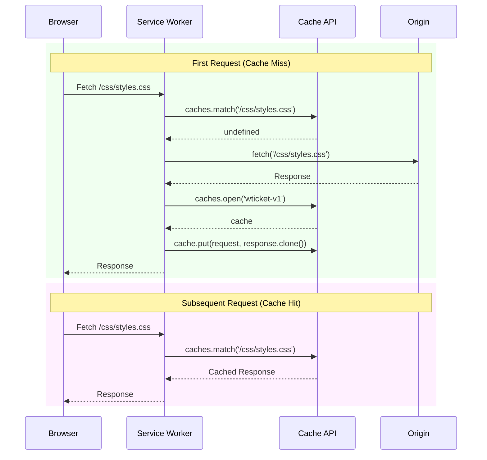

---

## 7. Error Communication Paths

### 7.1 Network Error Handling

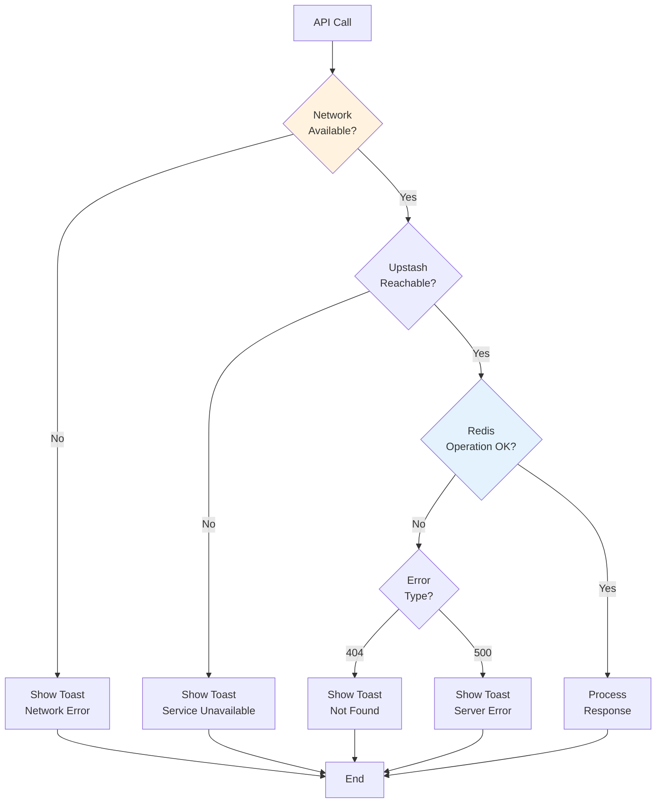

### 7.2 Redis Error Response Mapping

| Redis Error | HTTP Code | User Message | Action |
|-------------|-----------|--------------|--------|
| Connection timeout | 503 | "Connection error. Please retry." | Retry button |
| Auth failure | 401 | "Session expired. Please login." | Redirect to login |
| Rate limit | 429 | "Too many requests. Please wait." | Disable buttons |
| Invalid command | 500 | "An error occurred." | Log to console |

---

## 8. Data Serialization Formats

### 8.1 Request Format (JSON)

```json
// Registration Request (via Redis HSET)
{
  "email": "user@example.com",
  "passwordHash": "a1b2c3d4e5f6...",
  "name": "John Doe",
  "role": "user",
  "createdAt": 1711400000000
}

// Ticket Creation (via Redis HSET)
{
  "id": 42,
  "title": "Login issue",
  "description": "Cannot access my account",
  "userEmail": "user@example.com",
  "status": "open",
  "createdAt": 1711400000000,
  "response": "",
  "responseAt": 0
}
```

### 8.2 Response Format

```json
// Session Response
{
  "token": "abc123...",
  "user": {
    "email": "user@example.com",
    "name": "John Doe",
    "role": "user"
  }
}

// Stats Response
{
  "openCount": 15,
  "closedCount": 42,
  "totalCount": 57,
  "userCount": 12
}
```

---

*Document Version: 1.0*  
*Last Updated: 2026-03-25*
