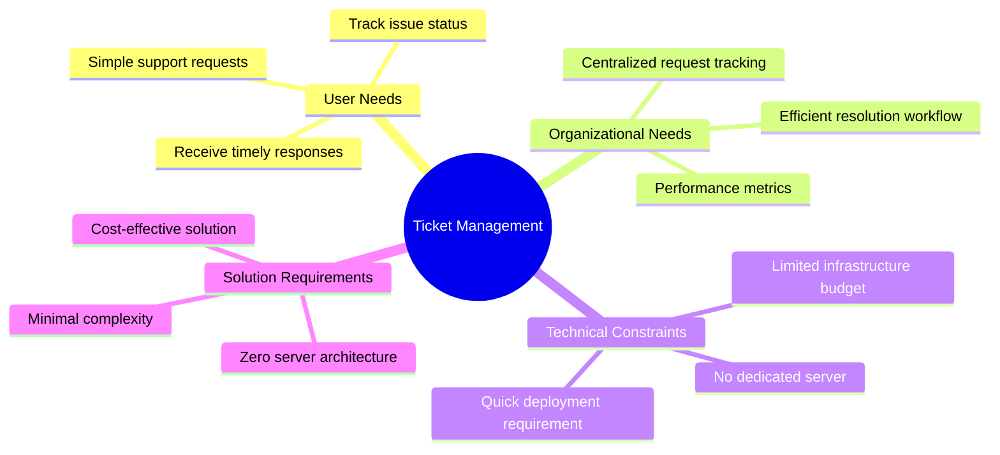
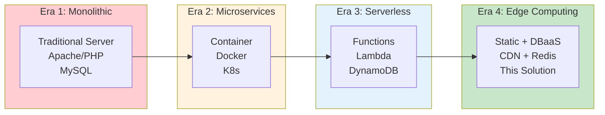

# Context, State of the Art & Research Documentation

> **Technical Reference**: This document provides contextual analysis, competitive landscape assessment, and relevant resources for the ticket management microservice.

---

## 1. Problem Statement

### 1.1 Business Context



### 1.2 Pain Points Addressed

| Pain Point | Traditional Solution | Our Solution |
|------------|---------------------|--------------|
| **Server costs** | Monthly hosting fees | Free static hosting |
| **Setup complexity** | Days of configuration | Minutes to deploy |
| **Maintenance burden** | Ongoing server management | Zero maintenance |
| **Scaling concerns** | Capacity planning | Auto-scale (CDN + Serverless) |

---

## 2. Market Analysis

### 2.1 Competitive Landscape

```mermaid
graph TB
    subgraph Commercial["Commercial Solutions"]
        ZD[Zendesk<br/>Enterprise-grade<br/>$$$]
        FR[Freshdesk<br/>SMB-focused<br/>($$)]
        HT[HelpScout<br/>Customer service<br/>($$)]
    end
    
    subgraph OpenSource["Open Source Alternatives"]
        OS[osTicket<br/>Self-hosted<br/>Free]
        RT[Request Tracker<br/>Enterprise OSS<br/>Free]
        GL[GitLab Issues<br/>Dev-focused<br/>Free"]
    end
    
    subgraph Serverless["Serverless Approaches"]
        US[This Solution<br/>Static + Redis<br/>Free tier"]
    end
    
    style Commercial fill:#fff3e0
    style OpenSource fill:#e3f2fd
    style Serverless fill:#c8e6c9
```

### 2.2 Feature Comparison Matrix

| Feature | This Solution | Zendesk | osTicket | GitLab |
|---------|--------------|---------|----------|--------|
| **Cost** | Free | $$$ | Free* | Free |
| **Setup Time** | Minutes | Days | Hours | Minutes |
| **Server Required** | ❌ No | Yes | Yes | Yes |
| **Customization** | Full | Limited | Full | Limited |
| **User Authentication** | ✅ Basic | ✅ Full | ✅ Basic | ✅ Full |
| **Role-based Access** | ✅ Yes | ✅ Yes | ✅ Yes | ✅ Yes |
| **Offline Support** | ✅ PWA | ❌ No | ❌ No | ❌ No |
| **Email Integration** | ❌ No | ✅ Yes | ✅ Yes | ✅ Yes |
| **Mobile App** | PWA | ✅ Yes | ❌ No | ✅ Yes |

---

## 3. Technical Context

### 3.1 Architecture Evolution



### 3.2 Technology Trend Analysis

| Trend | Impact | Our Adoption |
|-------|--------|--------------|
| **JAMstack** | Static sites + APIs | ✅ Core architecture |
| **Serverless** | No server management | ✅ Upstash Redis |
| **Edge Computing** | Low latency globally | ✅ GitHub Pages CDN |
| **PWA** | App-like experience | ✅ Service Worker |
| **Progressive Enhancement** | Graceful degradation | ✅ Core approach |

---

## 4. Research Sources

### 4.1 Technologies & Documentation

| Technology | Documentation | Relevance |
|------------|---------------|-----------|
| **Upstash Redis** | https://upstash.com/docs | Database layer |
| **ES Modules** | https://developer.mozilla.org/en-US/docs/Web/JavaScript/Guide/Modules | Module system |
| **Service Worker** | https://developer.mozilla.org/en-US/docs/Web/API/Service_Worker_API | PWA caching |
| **Web Crypto API** | https://developer.mozilla.org/en-US/docs/Web/API/SubtleCrypto | Password hashing |
| **CSS Custom Properties** | https://developer.mozilla.org/en-US/docs/Web/CSS/--* | Design system |

### 4.2 Security References

| Topic | Resource | Coverage |
|-------|----------|----------|
| **XSS Prevention** | https://owasp.org/www-community/OWASP_Validation_Revision_Project | Input sanitization |
| **Password Storage** | https://cheatsheetseries.owasp.org/cheatsheets/Password_Storage_Cheat_Sheet.html | Hashing best practices |
| **Session Management** | https://cheatsheetseries.owasp.org/cheatsheets/Session_Management_Cheat_Sheet.html | Token security |

---

## 5. Design Decision Rationale

### 5.1 Architecture Decisions

| Decision | Alternative Considered | Rationale |
|----------|----------------------|-----------|
| **Serverless Redis** | Local Redis server | Zero maintenance, auto-scale |
| **Static Frontend** | Node.js server | Free hosting, global CDN |
| **Client-side Auth** | JWT server-side | Simplified architecture |
| **SHA-256 Hashing** | bcrypt | Web Crypto native support |
| **ES Modules** | Bundlers (Webpack) | No build step required |

### 5.2 Trade-off Analysis

```mermaid
quadrantChart
    title Complexity vs. Functionality
    x-axis Low Complexity --> High Complexity
    y-axis Low Functionality --> High Functionality
    quadrant-1 High Value
    quadrant-2 Over-engineered
    quadrant-3 Under-engineered
    quadrant-4 Feature-poor
    
    This Solution: [0.3, 0.6]
    osTicket: [0.6, 0.8]
    Zendesk: [0.8, 0.95]
    Spreadsheet: [0.1, 0.3]
    
    note "This solution balances<br/>simplicity with core features"
```

---

## 6. Future Research Directions

### 6.1 Potential Enhancements

| Enhancement | Complexity | Impact | Priority |
|-------------|------------|--------|----------|
| **Email notifications** | Medium | High | P1 |
| **File attachments** | High | High | P2 |
| **Ticket categories** | Low | Medium | P2 |
| **Priority levels** | Low | Medium | P2 |
| **Analytics dashboard** | Medium | Medium | P3 |
| **Mobile app** | High | Medium | P3 |

### 6.2 Technology Watch

| Technology | Status | Potential Integration |
|------------|--------|---------------------|
| **Cloudflare Workers** | Emerging | Edge functions for auth |
| **Deno Deploy** | Maturing | Alternative deployment |
| **Bun** | Emerging | Faster module loading |
| **WebGPU** | Early | Future compute needs |

---

## 7. References

### 7.1 Academic & Industry Sources

| Source | Type | Relevance |
|--------|------|-----------|
| **JAMstack** | Article | Architecture pattern |
| **Serverless Architecture** | Book | Design principles |
| **OWASP Top 10** | Security | Security guidelines |
| **PWA Checklist** | Guidelines | Offline capabilities |

### 7.2 External Links

| Link | Purpose |
|------|---------|
| https://jamstack.org | Architecture reference |
| https://upstash.com | Database documentation |
| https://developer.mozilla.org | Web APIs reference |
| https://web.dev/pwa | PWA best practices |
| https://owasp.org | Security guidelines |

---

## 8. Glossary

| Term | Definition |
|------|------------|
| **JAMstack** | JavaScript, APIs, Markup - modern web development architecture |
| **Serverless** | Cloud execution model where server management is abstracted |
| **PWA** | Progressive Web App - web application with native-like capabilities |
| **Redis** | In-memory data structure store, used as database/cache |
| **CDN** | Content Delivery Network - geographically distributed servers |
| **ES Modules** | ECMAScript standard for module imports/exports |
| **SHA-256** | Secure Hash Algorithm - cryptographic hash function |
| **TLS** | Transport Layer Security - encryption protocol for network communication |

---

*Document Version: 1.0*  
*Last Updated: 2026-03-25*
