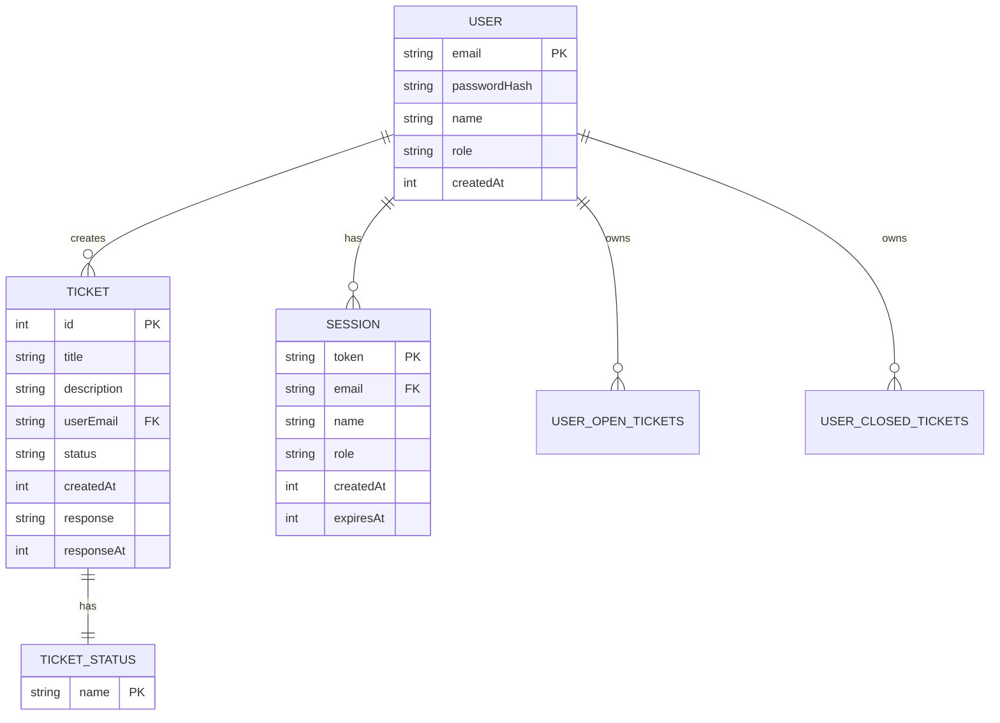
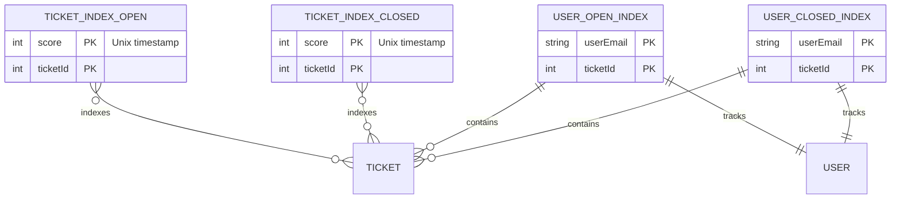
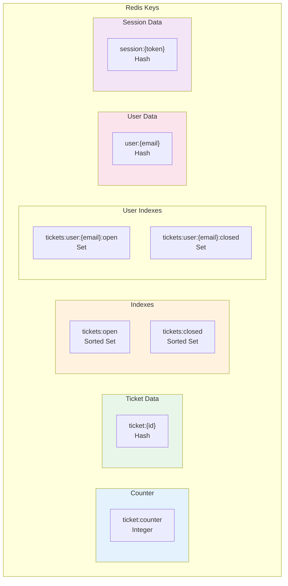
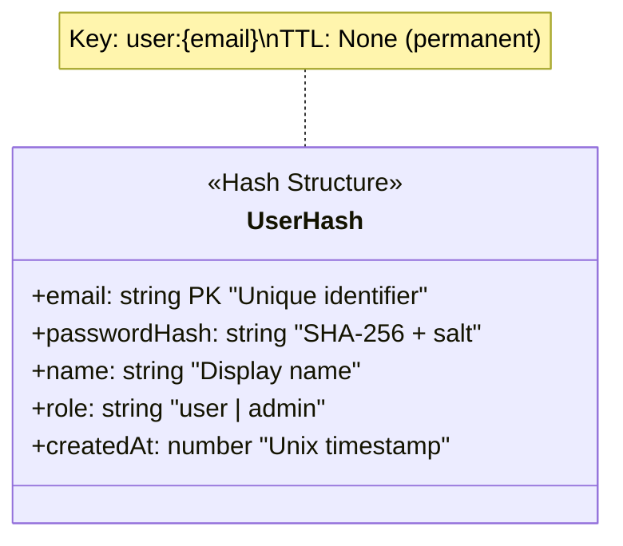
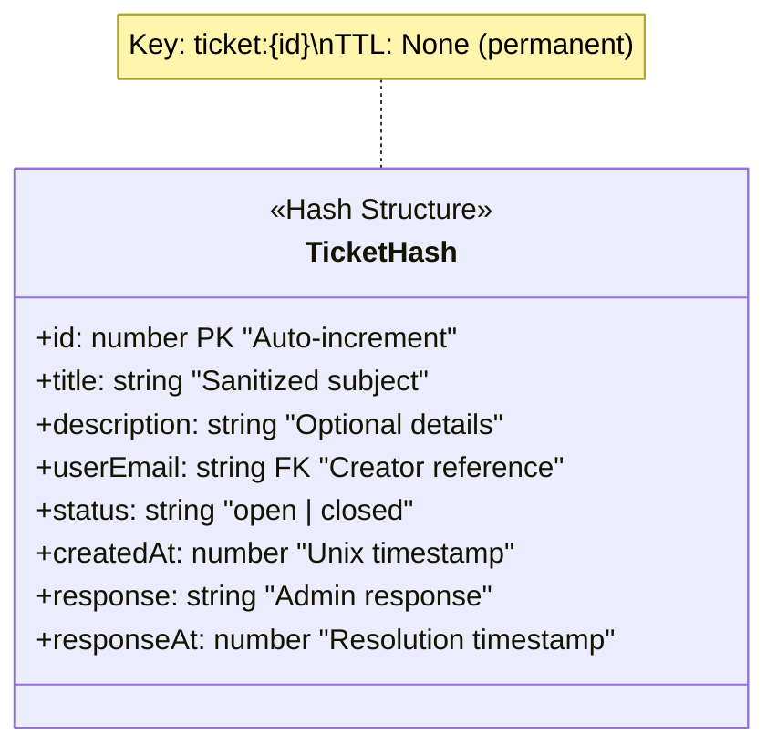
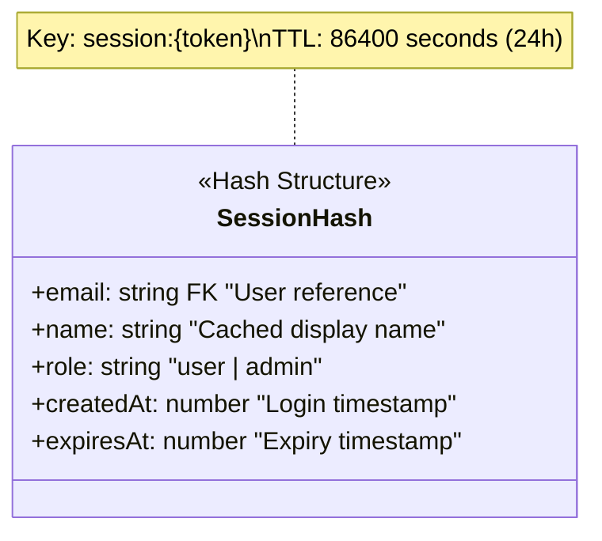
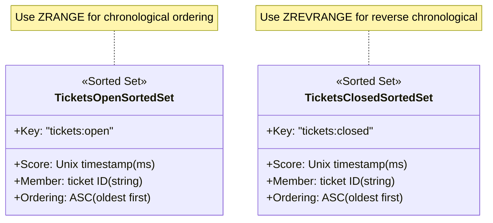
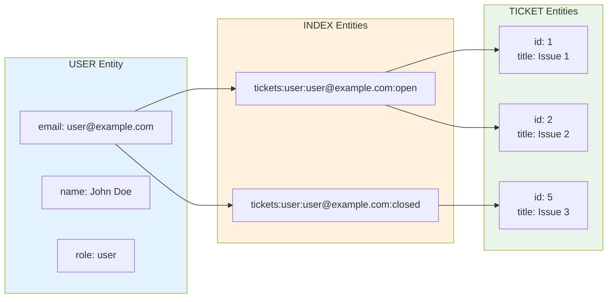
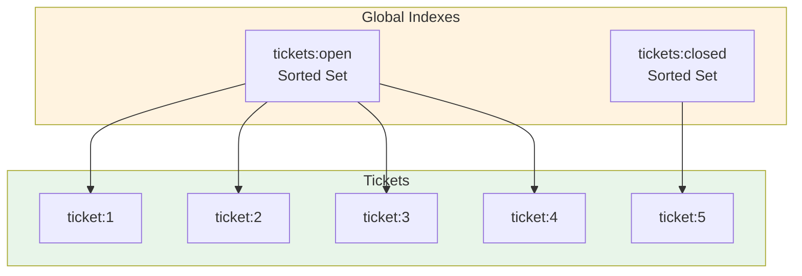

# Data Diagrams & Models Documentation

> **Technical Reference**: This document provides comprehensive data models, entity relationships, and schema definitions for the ticket management microservice.

---

## 1. Entity Relationship Diagram

### 1.1 Core Entities



### 1.2 Index Relationships



---

## 2. Redis Data Models

### 2.1 Key Structure Overview



### 2.2 Hash Structures

#### User Hash (`user:{email}`)



#### Ticket Hash (`ticket:{id}`)



#### Session Hash (`session:{token}`)



### 2.3 Sorted Set Structures



### 2.4 Set Structures

```mermaid
classDiagram
    class UserOpenTicketsSet {
        <<Set>>
        +Key: "tickets:user:{email}:open"
        +Members: ticket IDs (string)
        +Type: Set (unique members)
    }
    
    class UserClosedTicketsSet {
        <<Set>>
        +Key: "tickets:user:{email}:closed"
        +Members: ticket IDs (string)
        +Type: Set (unique members)
    }
    
    note for UserOpenTicketsSet "Use SMEMBERS to get all user's open tickets"
    note for UserClosedTicketsSet "Use SMEMBERS to get all user's closed tickets"
```

---

## 3. JSON Data Schemas

### 3.1 User Schema

```json
{
  "$schema": "http://json-schema.org/draft-07/schema#",
  "title": "User",
  "type": "object",
  "properties": {
    "email": {
      "type": "string",
      "format": "email",
      "description": "Unique email identifier"
    },
    "passwordHash": {
      "type": "string",
      "pattern": "^[a-f0-9]{64}$",
      "description": "SHA-256 hexadecimal hash"
    },
    "name": {
      "type": "string",
      "minLength": 1,
      "maxLength": 100,
      "description": "Display name"
    },
    "role": {
      "type": "string",
      "enum": ["user", "admin"],
      "description": "User role for authorization"
    },
    "createdAt": {
      "type": "integer",
      "minimum": 0,
      "description": "Unix timestamp in milliseconds"
    }
  },
  "required": ["email", "passwordHash", "role", "createdAt"]
}
```

### 3.2 Ticket Schema

```json
{
  "$schema": "http://json-schema.org/draft-07/schema#",
  "title": "Ticket",
  "type": "object",
  "properties": {
    "id": {
      "type": "integer",
      "minimum": 1,
      "description": "Auto-increment ticket identifier"
    },
    "title": {
      "type": "string",
      "minLength": 1,
      "maxLength": 500,
      "description": "Ticket subject (XSS sanitized)"
    },
    "description": {
      "type": "string",
      "maxLength": 5000,
      "description": "Detailed description (XSS sanitized)"
    },
    "userEmail": {
      "type": "string",
      "format": "email",
      "description": "Creator's email address"
    },
    "status": {
      "type": "string",
      "enum": ["open", "closed"],
      "description": "Current ticket status"
    },
    "createdAt": {
      "type": "integer",
      "minimum": 0,
      "description": "Creation Unix timestamp"
    },
    "response": {
      "type": "string",
      "maxLength": 5000,
      "description": "Admin response (XSS sanitized)"
    },
    "responseAt": {
      "type": "integer",
      "minimum": 0,
      "description": "Resolution Unix timestamp"
    }
  },
  "required": ["id", "title", "userEmail", "status", "createdAt"]
}
```

### 3.3 Session Schema

```json
{
  "$schema": "http://json-schema.org/draft-07/schema#",
  "title": "Session",
  "type": "object",
  "properties": {
    "email": {
      "type": "string",
      "format": "email",
      "description": "Associated user email"
    },
    "name": {
      "type": "string",
      "description": "Cached user display name"
    },
    "role": {
      "type": "string",
      "enum": ["user", "admin"],
      "description": "Cached user role"
    },
    "createdAt": {
      "type": "integer",
      "minimum": 0,
      "description": "Session creation timestamp"
    },
    "expiresAt": {
      "type": "integer",
      "minimum": 0,
      "description": "Session expiry timestamp"
    }
  },
  "required": ["email", "role", "expiresAt"]
}
```

### 3.4 Stats Schema

```json
{
  "$schema": "http://json-schema.org/draft-07/schema#",
  "title": "Stats",
  "type": "object",
  "properties": {
    "openCount": {
      "type": "integer",
      "minimum": 0,
      "description": "Number of open tickets"
    },
    "closedCount": {
      "type": "integer",
      "minimum": 0,
      "description": "Number of closed tickets"
    },
    "totalCount": {
      "type": "integer",
      "minimum": 0,
      "description": "Total ticket count"
    },
    "userCount": {
      "type": "integer",
      "minimum": 0,
      "description": "Registered user count"
    }
  },
  "required": ["openCount", "closedCount", "totalCount", "userCount"]
}
```

---

## 4. Data Flow Diagrams

### 4.1 Registration Data Flow

```mermaid
flowchart TD
    subgraph Input["Client Input"]
        Email[email: string]
        Pass[password: string]
        Name[name: string]
    end
    
    subgraph Processing["Processing"]
        Hash[hashPassword()<br/>SHA-256 + salt]
        Validate[Validate email<br/>format]
    end
    
    subgraph Storage["Redis Storage"]
        UserHash["user:{email}<br/>HSET"]
    end
    
    Email --> Validate
    Pass --> Hash
    Name --> UserHash
    Hash --> UserHash
    Validate --> Hash
    
    style Input fill:#e3f2fd
    style Processing fill:#fff3e0
    style Storage fill:#e8f5e9
```

### 4.2 Ticket Creation Data Flow

```mermaid
flowchart TD
    subgraph Input["Client Input"]
        Title[title: string]
        Desc[description: string]
        Email[userEmail: string]
    end
    
    subgraph Processing["Processing"]
        Sanitize[escapeHtml()<br/>XSS prevention]
        GenID[INCR ticket:counter]
        Timestamp[Date.now()]
    end
    
    subgraph Storage["Redis Storage"]
        TicketHash["ticket:{id}<br/>HSET"]
        OpenIndex["tickets:open<br/>ZADD"]
        UserOpen["tickets:user:{email}:open<br/>SADD"]
    end
    
    Title --> Sanitize
    Desc --> Sanitize
    Sanitize --> TicketHash
    GenID --> TicketHash
    Timestamp --> OpenIndex
    GenID --> OpenIndex
    GenID --> UserOpen
    Email --> UserOpen
    
    style Input fill:#e3f2fd
    style Processing fill:#fff3e0
    style Storage fill:#e8f5e9
```

---

## 5. Data Model Relationships

### 5.1 User-Ticket Relationship



### 5.2 Global Ticket Index



---

## 6. Data Type Reference

### 6.1 Redis Data Types Used

| Redis Type | Keys Using | Purpose |
|------------|------------|---------|
| **String** | `ticket:counter` | Atomic counter |
| **Hash** | `ticket:{id}`, `user:{email}`, `session:{token}` | Structured data |
| **Sorted Set** | `tickets:open`, `tickets:closed` | Ordered by timestamp |
| **Set** | `tickets:user:{email}:open`, `tickets:user:{email}:closed` | Unique membership |

### 6.2 Field Type Mappings

| Field | Redis Type | Serialization |
|-------|------------|--------------|
| email | String (Hash field) | Plain string |
| passwordHash | String (Hash field) | 64-char hex |
| name | String (Hash field) | Plain string |
| role | String (Hash field) | "user" or "admin" |
| createdAt | String (Hash field) | Unix ms as string |
| id | String (Hash field) | Integer as string |
| status | String (Hash field) | "open" or "closed" |

---

## 7. Data Integrity Constraints

### 7.1 Constraints Matrix

| Constraint | Type | Enforcement |
|------------|------|-------------|
| Email uniqueness | UNIQUE | Redis key prefix |
| Ticket ID uniqueness | AUTO_INCREMENT | Redis INCR |
| Role values | ENUM | Client-side validation |
| Status transitions | STATE_MACHINE | closeTicket() only |
| Session expiry | TTL | Redis EXPIRE |

### 7.2 State Transition Rules

```mermaid
stateDiagram-v2
    [*] --> Open: createTicket()
    
    state Open {
        [*] --> Indexed
        Indexed --> [*]
    }
    
    Open --> Closed: closeTicket()
    
    state Closed {
        [*] --> Responded
        Responded --> [*]
    }
    
    Closed --> [*]: Archive (future)
    
    note for Open: Only valid initial state
    note for Closed: Terminal state
```

---

*Document Version: 1.0*  
*Last Updated: 2026-03-25*
