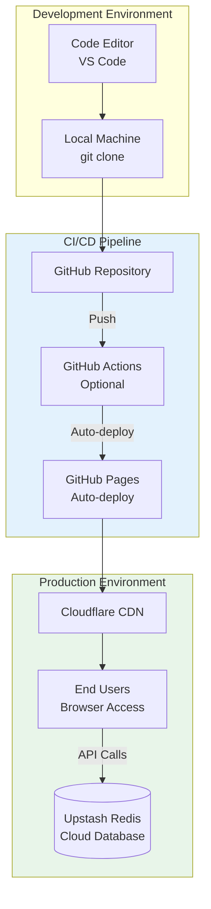
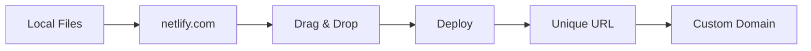
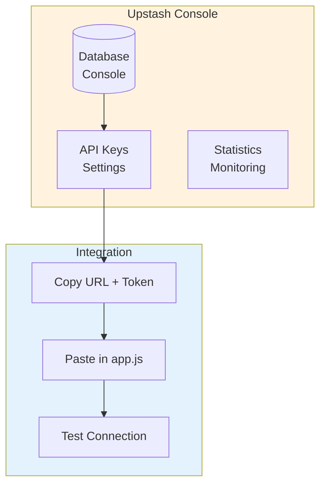
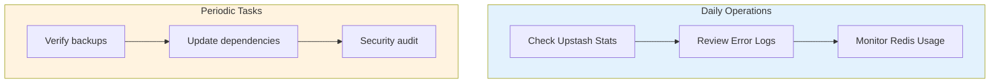
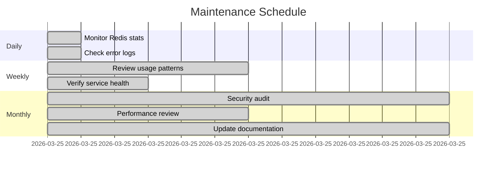
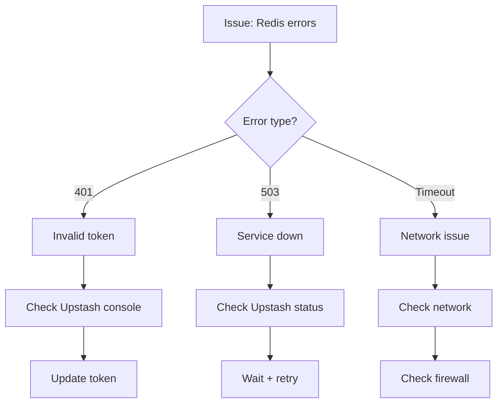
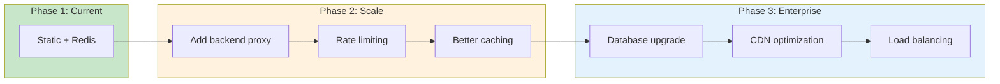

# Deployment, Operations & Maintenance Documentation

> **Technical Reference**: This document provides comprehensive deployment procedures, operational guidelines, and maintenance protocols for the ticket management microservice.

---

## 1. Deployment Overview

### 1.1 Deployment Architecture



### 1.2 Deployment Options

| Platform | Method | CDN | Auto-Deploy | Cost |
|----------|--------|-----|-------------|------|
| **GitHub Pages** | Push to repo | ✅ | ✅ Git push | Free |
| **Netlify** | Drag & drop | ✅ | ✅ Git | Free tier |
| **Vercel** | CLI deploy | ✅ | ✅ Git | Free tier |
| **Cloudflare Pages** | Git connect | ✅ | ✅ Git | Free |
| **Nginx** | rsync/scp | ❌ | Manual | Server cost |

---

## 2. GitHub Pages Deployment

### 2.1 Deployment Steps

```bash
# 1. Ensure repository structure is correct
wticket/
├── index.html
├── login.html
├── dashboard.html
├── admin.html
├── manifest.json
├── service-worker.js
├── css/
│   └── styles.css
└── js/
    ├── app.js
    └── toast.js

# 2. Commit all files
git add .
git commit -m "feat: initial deployment"
git push origin main

# 3. Enable GitHub Pages
# Repository → Settings → Pages → Source: main branch

# 4. Access at
# https://{username}.github.io/{repository}/
```

### 2.2 GitHub Actions Workflow (Optional)

```yaml
# .github/workflows/deploy.yml
name: Deploy to GitHub Pages

on:
  push:
    branches: [main]
  workflow_dispatch:

permissions:
  contents: read
  pages: write
  id-token: write

jobs:
  deploy:
    runs-on: ubuntu-latest
    steps:
      - name: Checkout
        uses: actions/checkout@v4
      
      - name: Setup Pages
        uses: actions/configure-pages@v4
      
      - name: Upload artifact
        uses: actions/upload-pages-artifact@v3
        with:
          path: '.'
      
      - name: Deploy to GitHub Pages
        id: deployment
        uses: actions/deploy-pages@v4
```

---

## 3. Alternative Deployment Methods

### 3.1 Netlify Deployment



```bash
# Option 1: CLI
npm install -g netlify-cli
netlify deploy --prod --dir=.

# Option 2: Git integration
# Connect repo in Netlify dashboard
```

### 3.2 Vercel Deployment

```bash
# Option 1: CLI
npm install -g vercel
vercel deploy

# Option 2: Git integration
# Connect repo in Vercel dashboard
```

---

## 4. Redis Configuration

### 4.1 Upstash Setup



### 4.2 Redis Credentials Setup

```javascript
// js/app.js - Configuration section
const REDIS = new Redis({
  url: 'YOUR_UPSTASH_REDIS_URL',    // From Upstash Console
  token: 'YOUR_UPSTASH_TOKEN',      // From Upstash Console
});
```

### 4.3 Upstash Redis Commands

| Command | Usage | Example |
|---------|-------|---------|
| GET | Read value | `redis.get('key')` |
| SET | Write value | `redis.set('key', 'value')` |
| HGETALL | Read hash | `redis.hgetall('hash:1')` |
| HSET | Write hash | `redis.hset('hash:1', {field: 'value'})` |
| ZADD | Add to sorted set | `redis.zadd('set', {score: 1, member: 'a'})` |
| ZRANGE | Read sorted set | `redis.zrange('set', 0, -1)` |
| SADD | Add to set | `redis.sadd('set', 'member')` |
| INCR | Increment counter | `redis.incr('counter')` |
| EXPIRE | Set TTL | `redis.expire('key', 86400)` |

---

## 5. Environment Configuration

### 5.1 Configuration Matrix

| Variable | Location | Type | Default | Required |
|----------|----------|------|---------|----------|
| `REDIS_URL` | js/app.js | String | - | Yes |
| `REDIS_TOKEN` | js/app.js | String | - | Yes |
| `ADMIN_EMAIL` | js/app.js | String | - | Yes |
| `ADMIN_PASSWORD` | js/app.js | String | - | Yes |
| `SESSION_DURATION` | js/app.js | Number | 86400000 | No |

### 5.2 Configuration Best Practices

```javascript
// js/app.js - Recommended configuration structure
const CONFIG = {
  redis: {
    url: 'YOUR_UPSTASH_REDIS_URL',
    token: 'YOUR_UPSTASH_TOKEN',
  },
  admin: {
    email: 'admin@yourdomain.com',
    password: 'SecurePassword123!',
  },
  session: {
    duration: 24 * 60 * 60 * 1000, // 24 hours
  },
};
```

---

## 6. Operations Guide

### 6.1 Monitoring Checklist

| Metric | How to Monitor | Alert Threshold |
|--------|---------------|-----------------|
| **Response Time** | Upstash Console | > 500ms |
| **Error Rate** | Console errors | > 1% |
| **Redis Usage** | Upstash Console | > 80% |
| **Daily Operations** | Upstash Console | Monitor spikes |

### 6.2 Operational Procedures



### 6.3 Backup Strategy

| Data | Backup Method | Frequency |
|------|--------------|-----------|
| **Redis Data** | Upstash automatic | Real-time replication |
| **Source Code** | Git repository | On every commit |
| **Configuration** | Environment variables | On change |

---

## 7. Maintenance Procedures

### 7.1 Regular Maintenance Tasks



### 7.2 Update Procedures

#### Critical Security Updates

```bash
# 1. Review changelog
git log --oneline -10

# 2. Test locally
python3 -m http.server 8000

# 3. Commit changes
git add .
git commit -m "fix: security patch"
git push

# 4. Verify deployment
# Check GitHub Pages URL
```

#### Minor Updates

```bash
# 1. Make changes
# Edit files as needed

# 2. Test locally
python3 -m http.server 8000

# 3. Commit and push
git add .
git commit -m "feat: new feature"
git push
```

---

## 8. Troubleshooting Guide

### 8.1 Common Issues

| Issue | Cause | Solution |
|-------|-------|----------|
| **Page not loading** | Wrong path | Check file structure |
| **Redis errors** | Wrong credentials | Verify URL and token |
| **Login not working** | Session issue | Clear localStorage |
| **PWA not installing** | Missing manifest | Verify manifest.json |
| **Service worker stale** | Old cache | Clear cache + reload |

### 8.2 Debug Procedures

```javascript
// In browser console:
// 1. Check API initialization
import API from './js/app.js';
await API.init();

// 2. Check Redis connection
const test = await API.getStats();
console.log('Stats:', test);

// 3. Check session
const session = await API.validateSession();
console.log('Session:', session);

// 4. Clear session and retry
localStorage.removeItem('wticket_token');
```

### 8.3 Network Debugging



---

## 9. Scaling Considerations

### 9.1 Current Limits

| Resource | Current Limit | Notes |
|----------|--------------|-------|
| **Redis Operations** | Plan-dependent | Upstash Free: 10K/day |
| **Concurrent Users** | Unlimited* | *Limited by Redis ops |
| **Ticket Storage** | Redis memory | Upstash Free: 256MB |

### 9.2 Scaling Path



---

## 10. Disaster Recovery

### 10.1 Recovery Procedures

| Scenario | Recovery Time | Procedure |
|----------|--------------|-----------|
| **GitHub Pages down** | < 5 min | Switch to Netlify/Vercel |
| **Redis data loss** | N/A | Upstash auto-replication |
| **Code corrupted** | < 1 min | git reset --hard |
| **Credentials leaked** | < 10 min | Rotate + redeploy |

### 10.2 Recovery Checklist

```bash
# 1. Verify code integrity
git status
git log --oneline -5

# 2. Test Redis connection
# Run test script in browser

# 3. Verify deployment
curl -I https://your-url.com/index.html

# 4. Test critical flows
# - Registration
# - Login
# - Create ticket
# - Admin resolve
```

---

*Document Version: 1.0*  
*Last Updated: 2026-03-25*
