# Frontend & User Interface Documentation

> **Technical Reference**: This document provides comprehensive documentation for the frontend components, user interface design, and user experience patterns of the ticket management microservice.

---

## 1. Frontend Architecture

### 1.1 Component Hierarchy

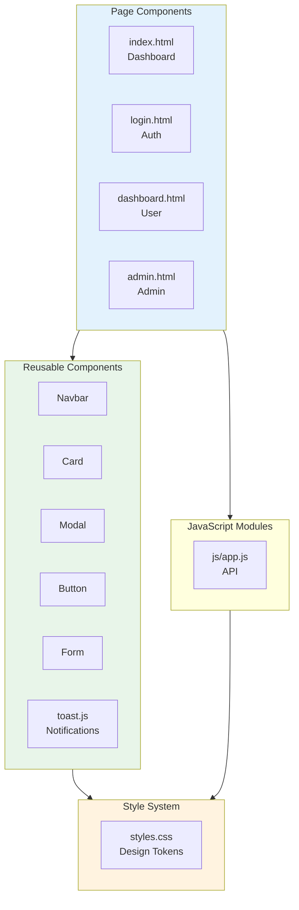

### 1.2 Page Responsibilities

| Page | Responsibilities | State Dependencies |
|------|-----------------|------------------|
| **index.html** | Stats display, nav, actions | None (public) |
| **login.html** | Auth forms, validation | Session check |
| **dashboard.html** | Ticket CRUD, search, modals | User session |
| **admin.html** | Admin actions, stats, search | Admin session |

---

## 2. Design System

### 2.1 Design Tokens

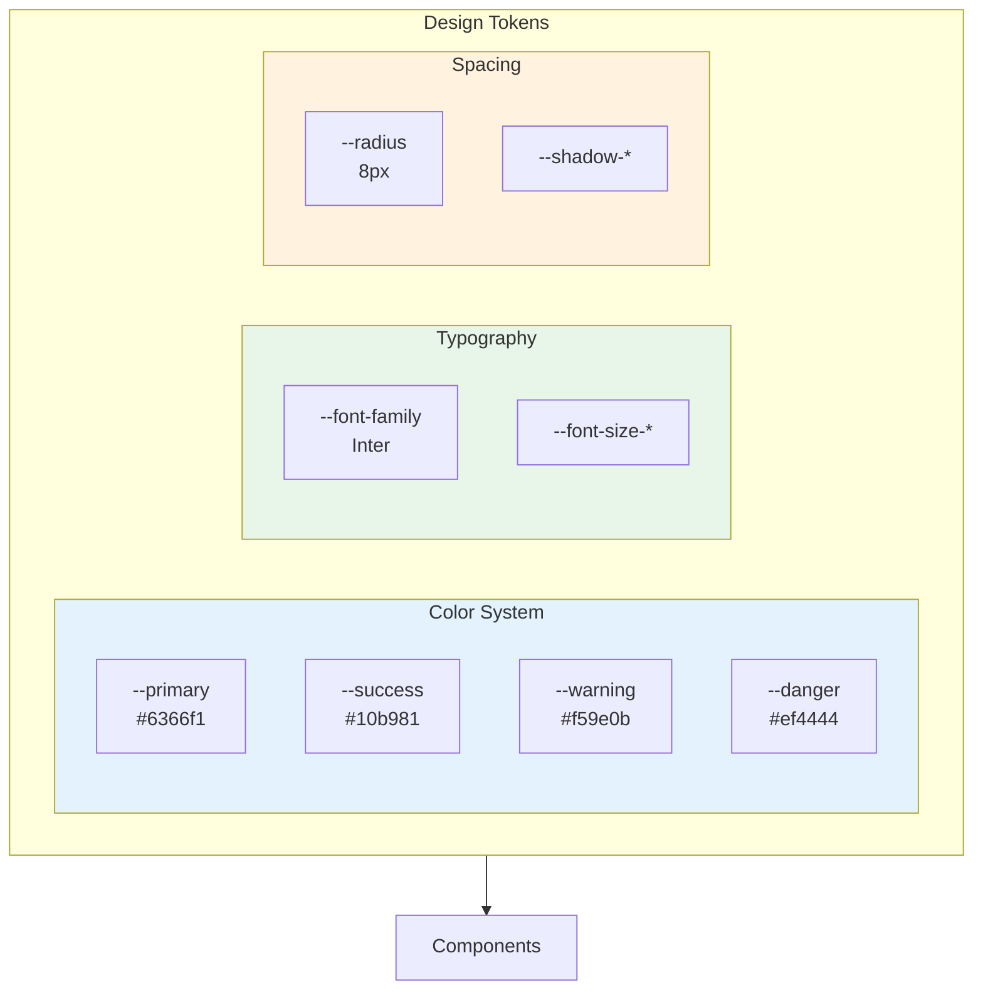

### 2.2 Color Palette

| Token | Hex | Usage | States |
|-------|-----|-------|--------|
| `--primary` | `#6366f1` | Buttons, links, brand | Default |
| `--primary-dark` | `#4f46e5` | Hover states | Hover |
| `--success` | `#10b981` | Positive actions, closed | Success |
| `--warning` | `#f59e0b` | Warnings, pending | Warning |
| `--danger` | `#ef4444` | Errors, destructive | Error |
| `--gray-50` | `#f9fafb` | Light backgrounds | Background |
| `--gray-900` | `#111827` | Primary text | Text |

### 2.3 Typography Scale

| Token | Size | Weight | Usage |
|-------|------|--------|-------|
| `--font-size-base` | 14px | 400 | Body text |
| `--font-size-sm` | 12px | 400 | Meta text |
| `--font-size-xs` | 11px | 600 | Badges |
| `--font-size-lg` | 16px | 500 | Subheadings |
| `--font-size-xl` | 18px | 600 | Headings |
| `--font-size-2xl` | 28px | 700 | Page titles |

---

## 3. Component Specifications

### 3.1 Navigation Bar

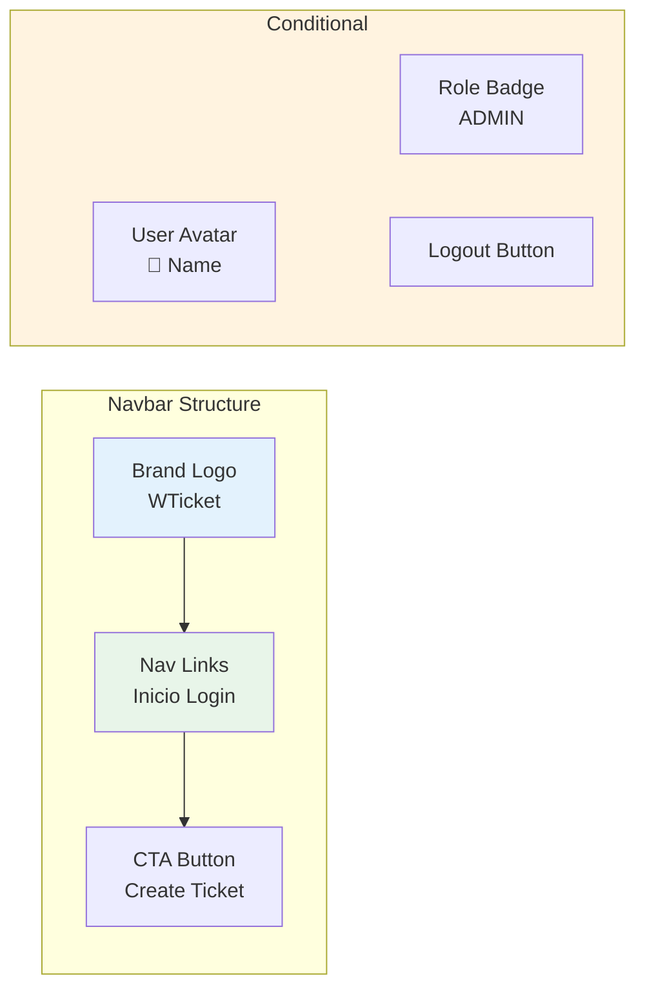

### 3.2 Card Component

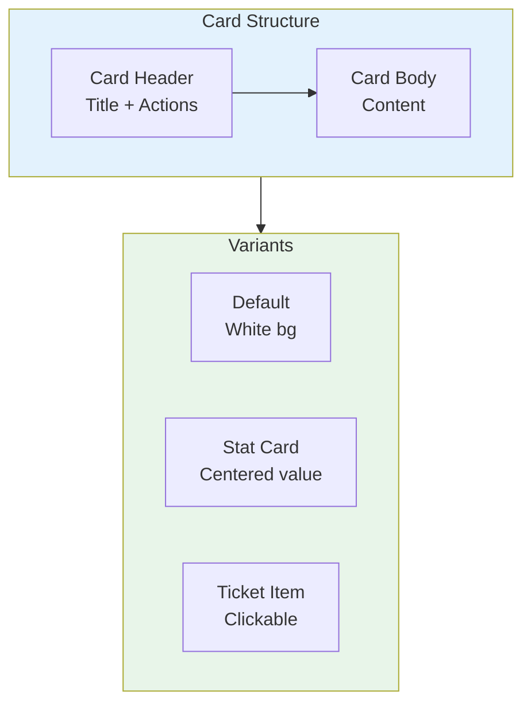

### 3.3 Button Variants

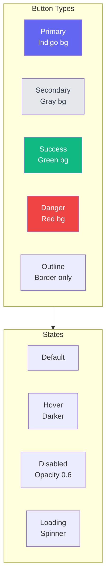

### 3.4 Modal Component

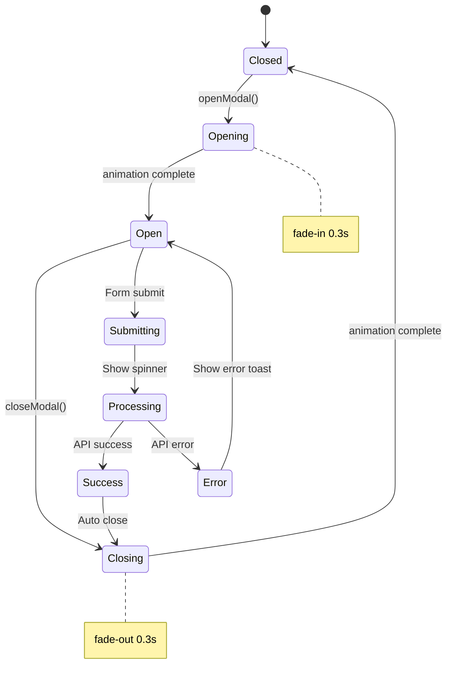

### 3.5 Toast Notifications

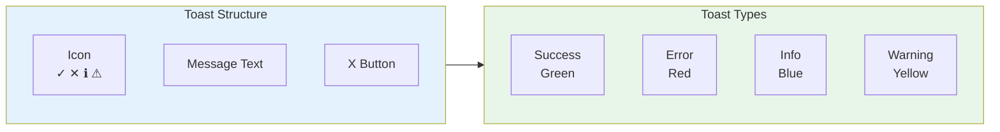

---

## 4. Page Layouts

### 4.1 Dashboard Layout

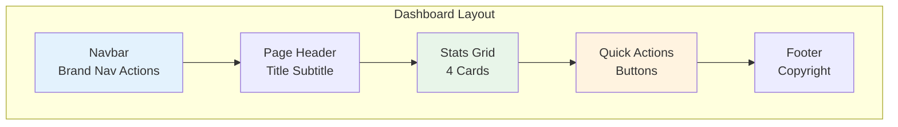

### 4.2 User Dashboard Layout

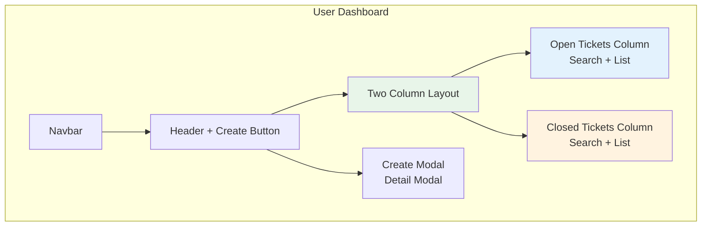

### 4.3 Admin Panel Layout

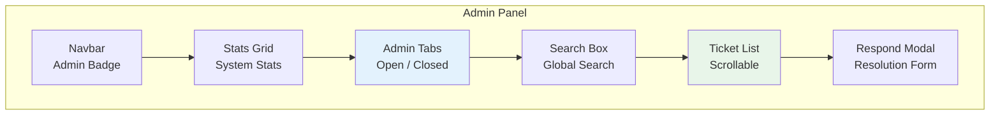

---

## 5. User Interactions

### 5.1 Form Interactions

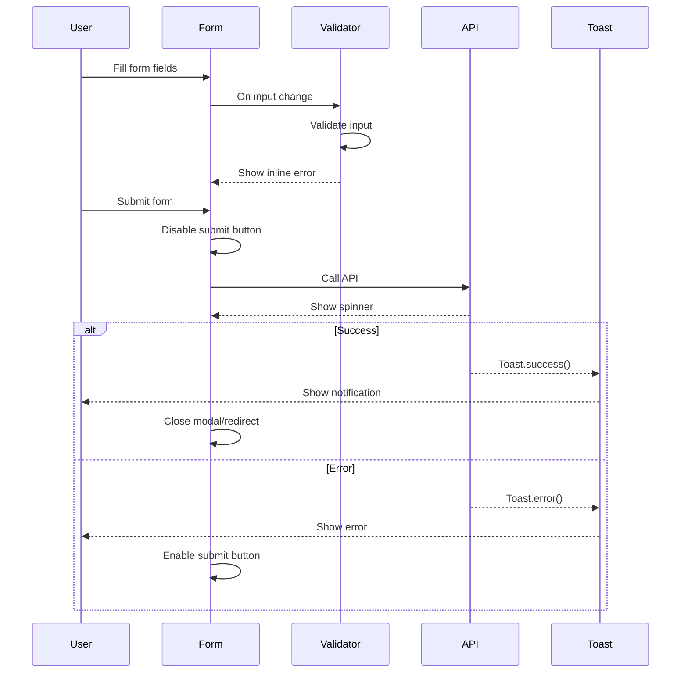

### 5.2 Search Interaction

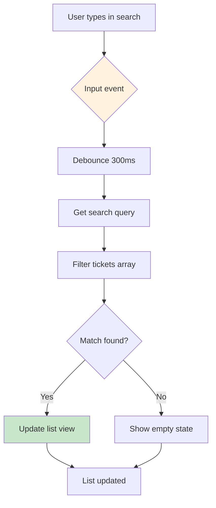

### 5.3 Modal Interactions

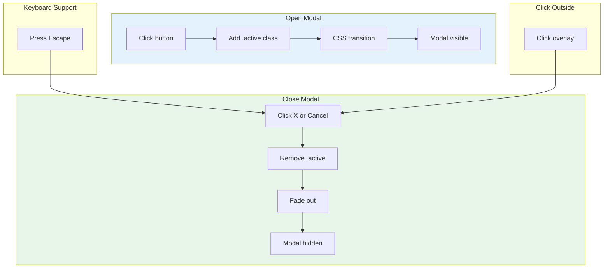

---

## 6. Responsive Design

### 6.1 Breakpoints

| Breakpoint | Width | Layout |
|------------|-------|--------|
| **Mobile** | < 768px | Single column |
| **Tablet** | 768px - 1024px | Adaptive |
| **Desktop** | > 1024px | Full layout |

### 6.2 Responsive Grid

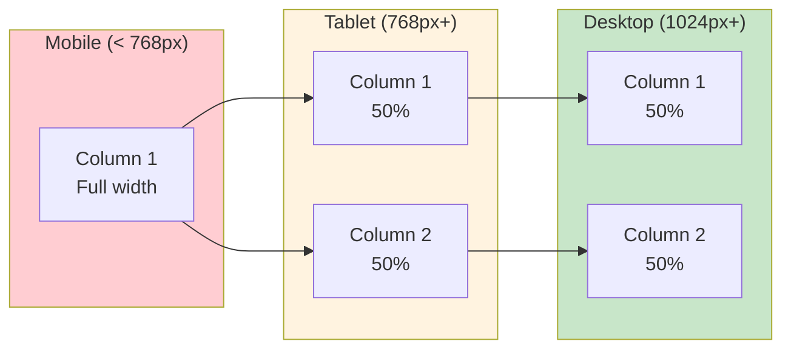

### 6.3 Responsive Adjustments

| Element | Desktop | Mobile |
|---------|---------|--------|
| **Two Columns** | Side by side | Stacked |
| **Stats Grid** | 4 columns | 2 columns |
| **Navbar** | Full links | Hamburger (future) |
| **Modal** | 500px max-width | 90% width |

---

## 7. Accessibility

### 7.1 ARIA Labels

| Component | ARIA Attribute | Value |
|-----------|---------------|-------|
| **Navbar** | `role="navigation"` | ✅ |
| **Buttons** | `aria-label` | Dynamic |
| **Modals** | `role="dialog"` | ✅ |
| **Toasts** | `role="alert"` | ✅ |
| **Search** | `aria-label="Search"` | ✅ |

### 7.2 Keyboard Navigation

| Key | Action | Context |
|-----|--------|---------|
| **Tab** | Navigate focus | All interactive elements |
| **Enter** | Submit/Activate | Buttons, links |
| **Escape** | Close modal | Modals |
| **Focus trap** | Stay in modal | When modal open |

### 7.3 Color Contrast

| Element | Foreground | Background | Ratio | WCAG |
|---------|-----------|------------|-------|------|
| **Primary button** | White | #6366f1 | 4.5:1 | AA ✅ |
| **Body text** | #374151 | #f9fafb | 12:1 | AAA ✅ |
| **Muted text** | #6b7280 | White | 4.6:1 | AA ✅ |

---

## 8. Animation Specifications

### 8.1 Animation Tokens

| Token | Value | Usage |
|-------|-------|-------|
| `--transition-fast` | 150ms | Hover states |
| `--transition-normal` | 300ms | Modals, toasts |
| `--transition-slow` | 500ms | Page transitions |

### 8.2 Animation Patterns

```css
/* Fade in */
@keyframes fadeIn {
  from { opacity: 0; transform: translateY(10px); }
  to { opacity: 1; transform: translateY(0); }
}

/* Slide in (toast) */
@keyframes slideIn {
  from { transform: translateX(100%); opacity: 0; }
  to { transform: translateX(0); opacity: 1; }
}

/* Spin (loading) */
@keyframes spin {
  to { transform: rotate(360deg); }
}
```

### 8.3 Loading States

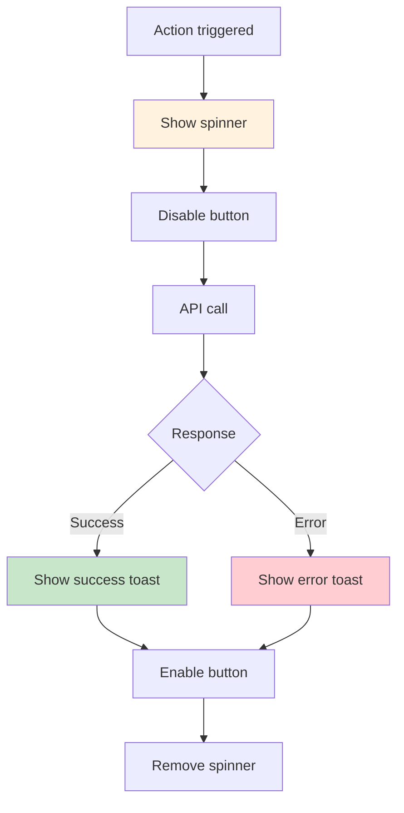

---

## 9. PWA Integration

### 9.1 Install Prompt

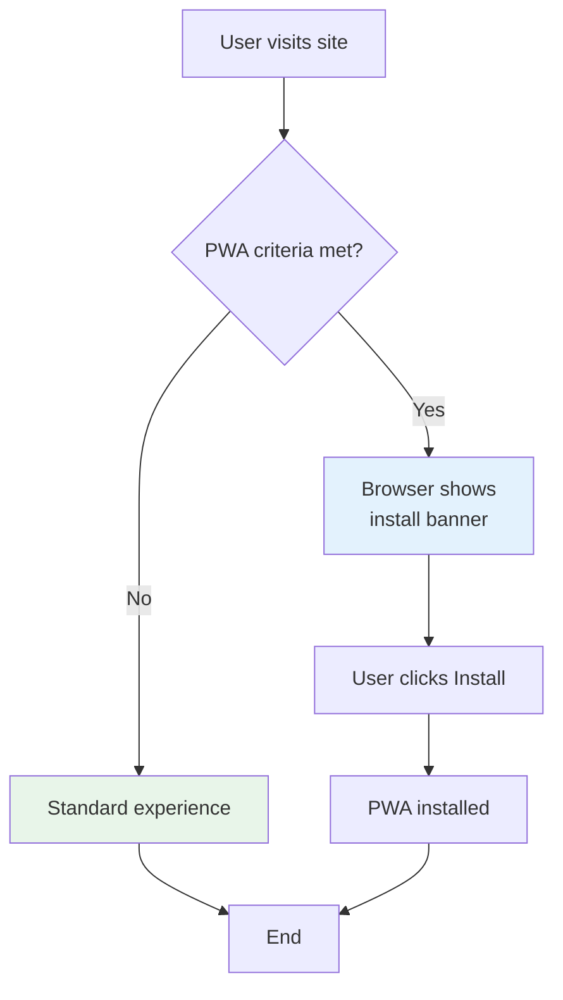

### 9.2 Offline Capabilities

| Feature | Offline Support | Implementation |
|---------|----------------|----------------|
| **View pages** | ✅ Full | Service worker cache |
| **View cached data** | ❌ | Requires network |
| **Create tickets** | ❌ | Requires network |
| **Authenticate** | ❌ | Requires network |

---

## 10. Performance Optimizations

### 10.1 Loading Strategy

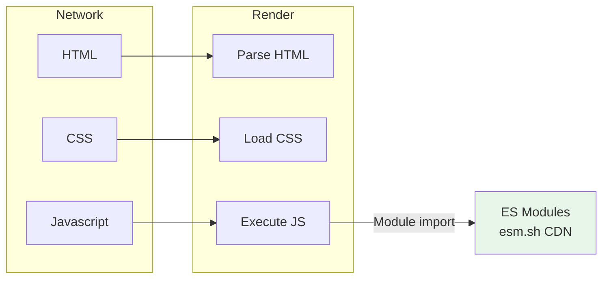

### 10.2 Lazy Interactions

| Interaction | Trigger | Implementation |
|-------------|---------|----------------|
| **Toast** | On demand | Dynamic injection |
| **Modal** | Click | Dynamic injection |
| **API calls** | On demand | No pre-fetch |

---

*Document Version: 1.0*  
*Last Updated: 2026-03-25*
