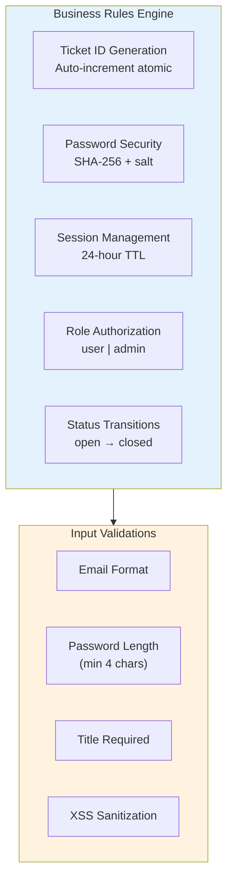
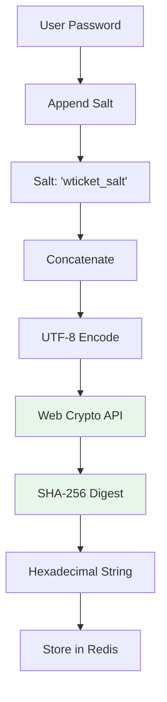
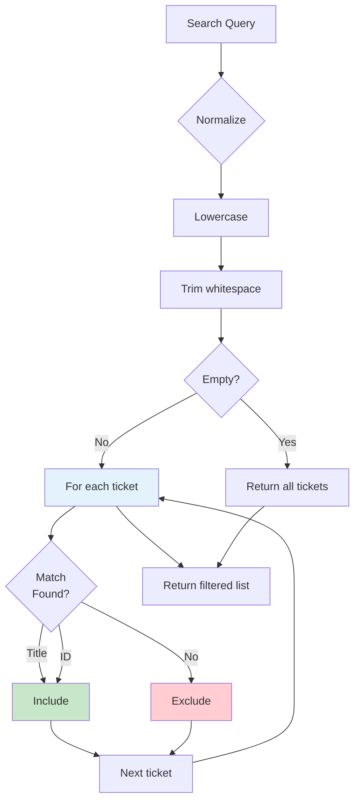
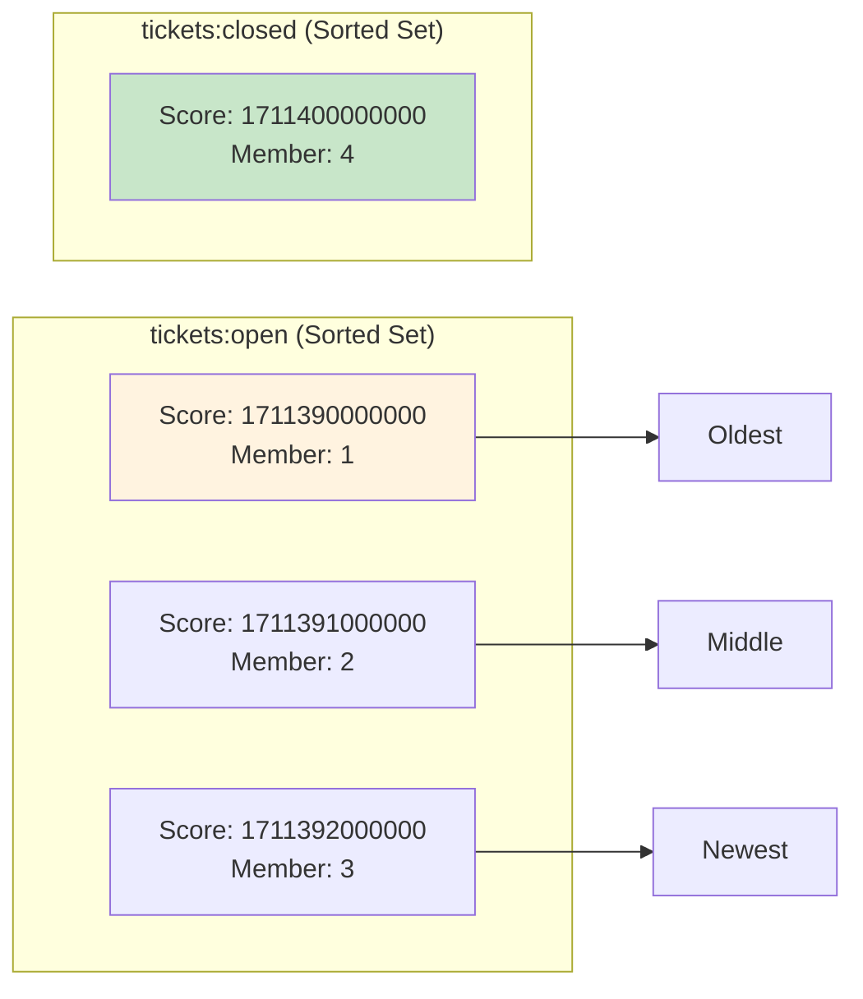
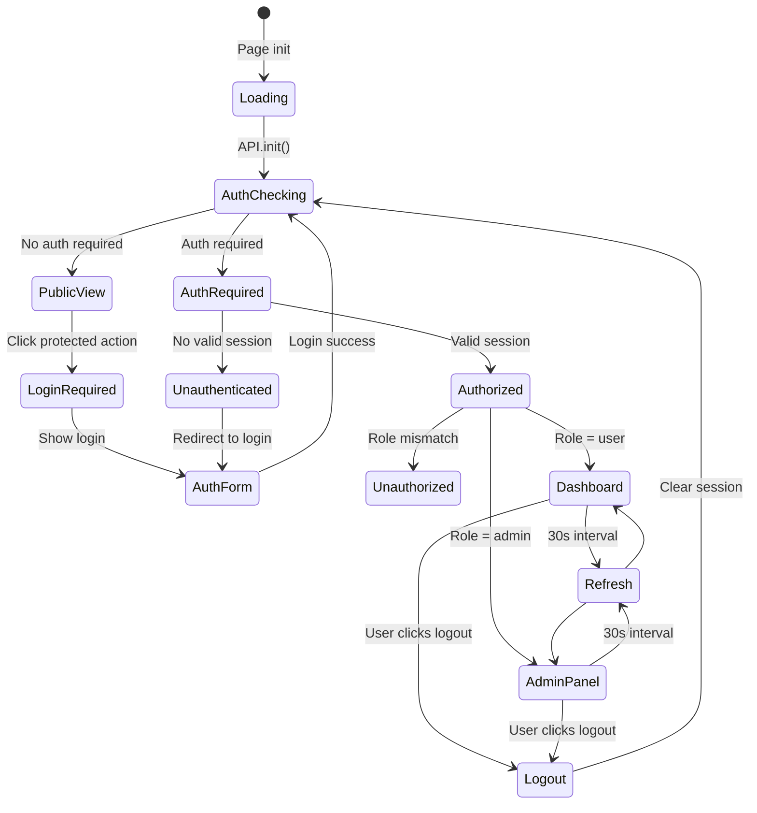
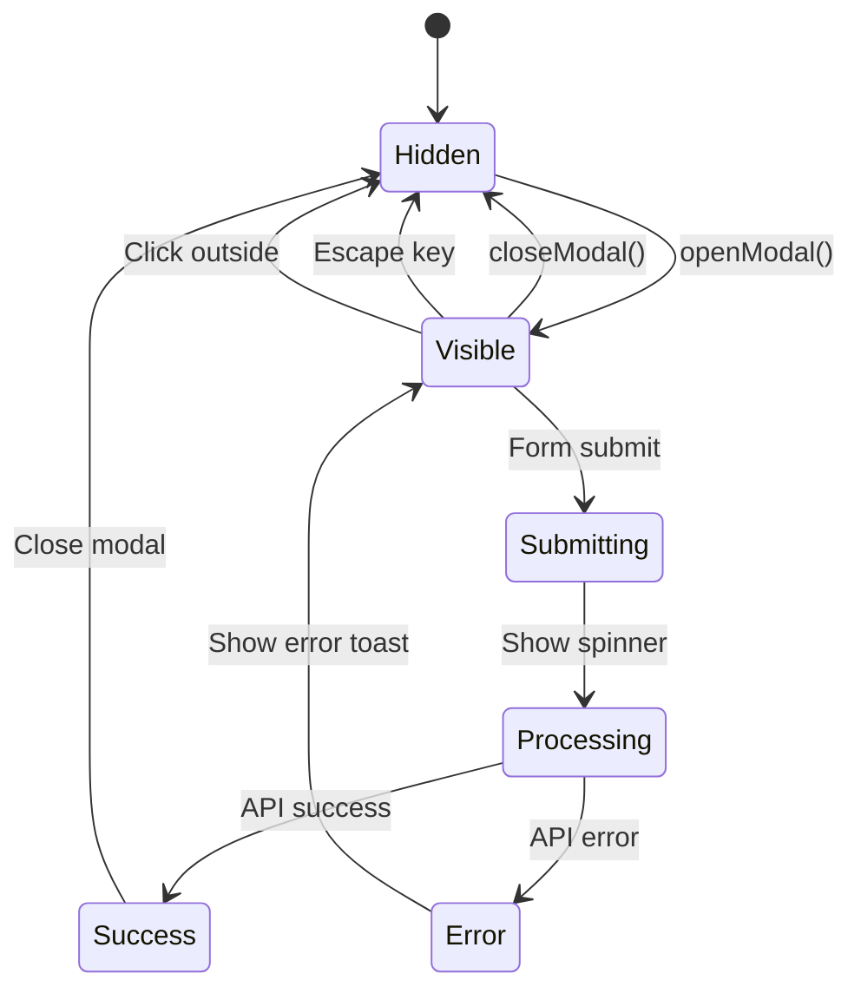
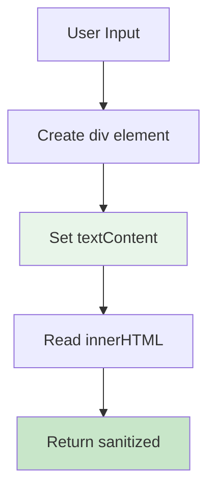
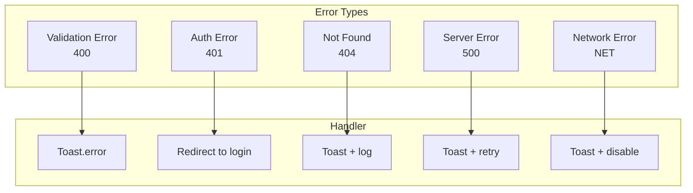

# Logic Design Documentation

> **Technical Reference**: This document details the business logic, algorithms, and decision flows of the ticket management microservice.

---

## 1. Business Logic Overview

### 1.1 Core Business Rules



### 1.2 Business Rules Matrix

| Rule ID | Rule Description | Priority | Enforced At |
|---------|-----------------|----------|-------------|
| BR-001 | Ticket IDs are sequential integers starting from 1 | Critical | Redis INCR |
| BR-002 | Passwords must be hashed before storage | Critical | app.js |
| BR-003 | Sessions expire after 24 hours | High | Redis EXPIRE |
| BR-004 | Only admins can resolve tickets | High | admin.html auth check |
| BR-005 | Users can only view their own tickets | High | getUserOpenTickets() |
| BR-006 | Ticket status can only transition open → closed | High | closeTicket() |
| BR-007 | Admin user is auto-created on first init | Medium | ensureAdminExists() |
| BR-008 | All user inputs are XSS-sanitized | Critical | escapeHtml() |

---

## 2. Authentication Logic

### 2.1 Password Hashing Algorithm



```javascript
// Pseudocode
function hashPassword(password) {
    return sha256(password + 'wticket_salt');
}

async function sha256(str) {
    const data = new TextEncoder().encode(str);
    const hash = await crypto.subtle.digest('SHA-256', data);
    return Array.from(new Uint8Array(hash))
        .map(b => b.toString(16).padStart(2, '0'))
        .join('');
}
```

### 2.2 Token Generation Algorithm

```mermaid
flowchart LR
    A[Generate 32 bytes] --> B[crypto.getRandomValues]
    B --> C[Convert to hex]
    C --> D[64-character string]
    D --> E[Store as session:{token}]
    E --> F[Set EXPIRE 86400]
```

```javascript
function generateToken() {
    return Array.from(crypto.getRandomValues(new Uint8Array(32)))
        .map(b => b.toString(16).padStart(2, '0'))
        .join('');
}
```

### 2.3 Session Validation Flow

```mermaid
flowchart TD
    Start[Validate Session] --> GetToken
    GetToken[localStorage.getItem] --> Check{Token<br/>Exists?}
    Check -->|No| ReturnNull
    Check -->|Yes| QueryRedis
    
    QueryRedis[HGETALL session:{token}] --> Found{User<br/>Found?}
    Found -->|No| ClearStorage
    Found -->|Yes| CheckExpiry
    
    ClearStorage[localStorage.removeItem] --> ReturnNull
    CheckExpiry{Date.now <<br/> expiresAt?}
    CheckExpiry -->|Expired| DeleteSession
    CheckExpiry -->|Valid| ReturnSession
    
    DeleteSession[REDIS DEL session:{token}] --> ClearStorage
    
    ReturnNull[return null]
    ReturnSession[return {email, name, role}]
    
    style CheckExpiry fill:#fff3e0
    style ReturnNull fill:#ffcdd2
    style ReturnSession fill:#c8e6c9
```

---

## 3. Ticket Management Logic

### 3.1 Ticket ID Generation

```mermaid
flowchart TD
    A[Create Ticket] --> B[INCR ticket:counter]
    B --> C[Atomic Increment]
    C --> D[Return New ID]
    D --> E[HSET ticket:{id}]
    
    style B fill:#e3f2fd
    style C fill:#e8f5e9
```

### 3.2 Ticket Creation Flow

```mermaid
flowchart TD
    Start[Create Ticket] --> ValidateInput
    ValidateInput --> GetNextID
    
    GetNextID[INCR ticket:counter] --> CreateHash
    
    CreateHash[HSET ticket:{id}] --> AddToOpen
    CreateHash --> AddToUserOpen
    
    AddToOpen[ZADD tickets:open] --> ReturnID
    AddToUserOpen[SADD tickets:user:{email}:open] --> ReturnID
    
    ReturnID[return ticketId]
    
    subgraph Validation
        ValidateInput --> CheckTitle{title<br/>required?}
        CheckTitle -->|No| Error1[throw Error]
        CheckTitle -->|Yes| Sanitize[escapeHtml]
        Sanitize --> GetNextID
    end
    
    style GetNextID fill:#e8f5e9
    style CreateHash fill:#e3f2fd
```

### 3.3 Ticket Closure Flow (Admin)

```mermaid
flowchart TD
    Start[Admin Closes Ticket] --> FindTicket
    
    FindTicket[GET ticket:{id}] --> Found{Found?}
    Found -->|No| Error
    Found -->|Yes| UpdateHash
    
    UpdateHash[HSET status: closed<br/>response<br/>responseAt] --> UpdateIndexes
    
    UpdateIndexes --> RemoveFromOpen[ZREM tickets:open]
    UpdateIndexes --> AddToClosed[ZADD tickets:closed]
    UpdateIndexes --> RemoveFromUserOpen[SREM]
    UpdateIndexes --> AddToUserClosed[SADD]
    
    RemoveFromOpen --> Complete
    AddToClosed --> Complete
    RemoveFromUserOpen --> Complete
    AddToUserClosed --> Complete
    
    Complete[return]
    Error[throw Error]
    
    style UpdateHash fill:#e3f2fd
    style UpdateIndexes fill:#fff3e0
```

---

## 4. Search Logic

### 4.1 Search Algorithm



### 4.2 Search Implementation

```javascript
function searchTickets(tickets, query) {
    if (!query) return tickets;
    
    const q = query.toLowerCase();
    return tickets.filter(ticket => {
        const titleMatch = ticket.title.toLowerCase().includes(q);
        const idMatch = ticket.id.toString().includes(q);
        return titleMatch || idMatch;
    });
}
```

---

## 5. Data Indexing Logic

### 5.1 Index Maintenance

```mermaid
flowchart TB
    subgraph WriteOps["Write Operations"]
        Create[Create Ticket] --> ID1[ZADD tickets:open]
        Create --> ID2[SADD tickets:user:{email}:open]
        Close[Close Ticket] --> ID3[ZREM tickets:open]
        Close --> ID4[ZADD tickets:closed]
        Close --> ID5[SREM tickets:user:{email}:open]
        Close --> ID6[SADD tickets:user:{email}:closed]
    end
    
    subgraph ReadOps["Read Operations"]
        Open[Get Open Tickets] --> Query1[ZRANGE tickets:open]
        UserOpen[Get User Open] --> Query2[SMEMBERS tickets:user:{email}:open]
        Stats[Get Stats] --> Query3[ZCARD tickets:open<br/>ZCARD tickets:closed<br/>KEYS user:*]
    end
    
    style WriteOps fill:#e3f2fd
    style ReadOps fill:#e8f5e9
```

### 5.2 Sorted Set Ordering



---

## 6. State Management

### 6.1 Application States



### 6.2 Modal States



---

## 7. XSS Protection Logic

### 7.1 Sanitization Algorithm



```javascript
function escapeHtml(text) {
    const div = document.createElement('div');
    div.textContent = text;  // Automatically escapes HTML
    return div.innerHTML;
}

// Example:
// Input:  <script>alert('xss')</script>
// Output: &lt;script&gt;alert('xss')&lt;/script&gt;
```

### 7.2 Sanitization Coverage

| Input Field | Sanitized | Method |
|-------------|-----------|--------|
| Ticket title | ✅ | escapeHtml() |
| Ticket description | ✅ | escapeHtml() |
| Admin response | ✅ | escapeHtml() |
| User name | ❌ | Not stored |
| Email | ❌ | Not rendered as HTML |

---

## 8. Error Handling Logic

### 8.1 Error Classification



### 8.2 Retry Logic

```javascript
async function withRetry(fn, maxRetries = 3) {
    for (let i = 0; i < maxRetries; i++) {
        try {
            return await fn();
        } catch (error) {
            if (i === maxRetries - 1) throw error;
            await new Promise(r => setTimeout(r, 1000 * (i + 1)));
        }
    }
}
```

---

*Document Version: 1.0*  
*Last Updated: 2026-03-25*
