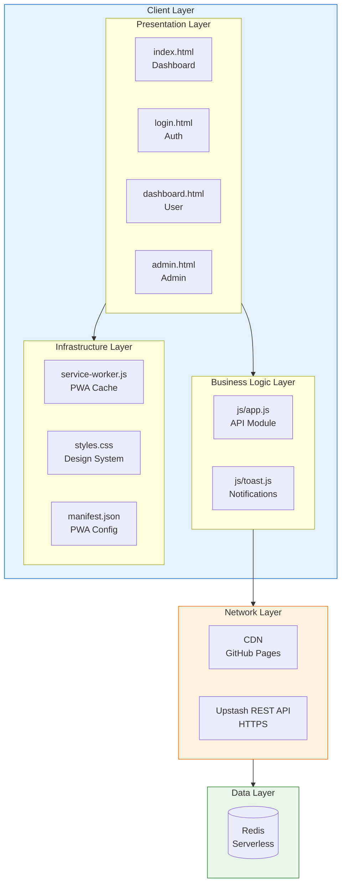
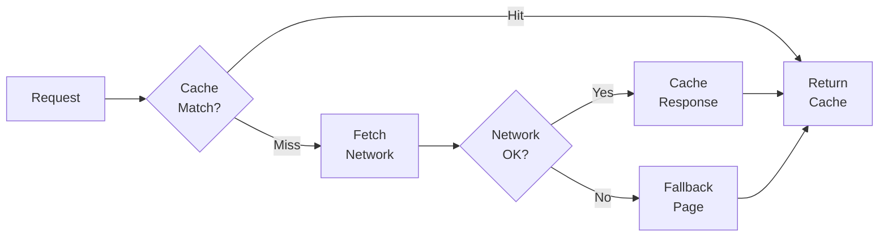
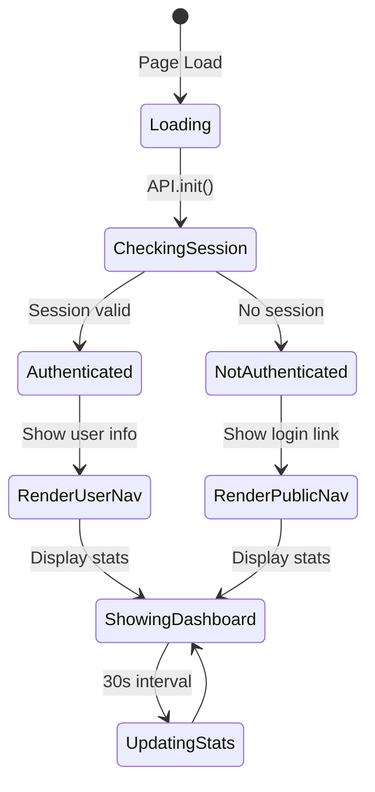
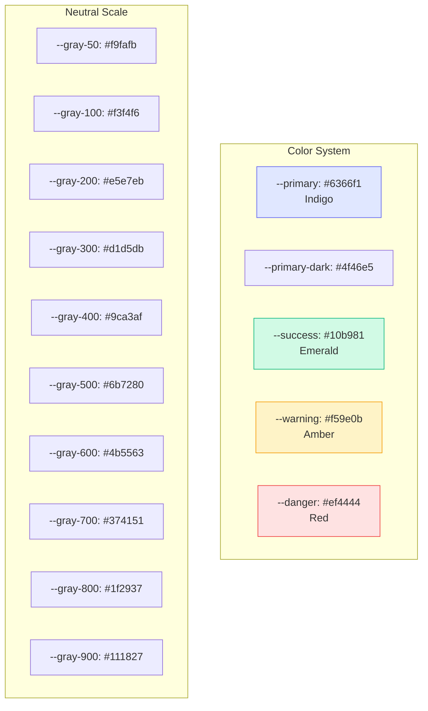
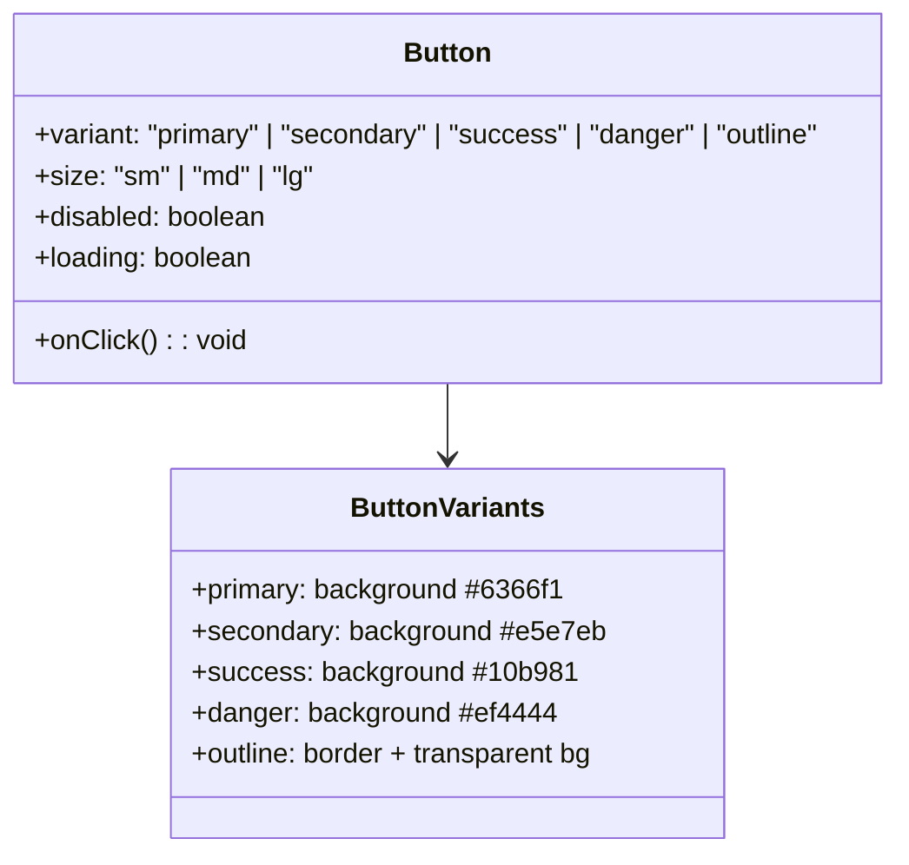
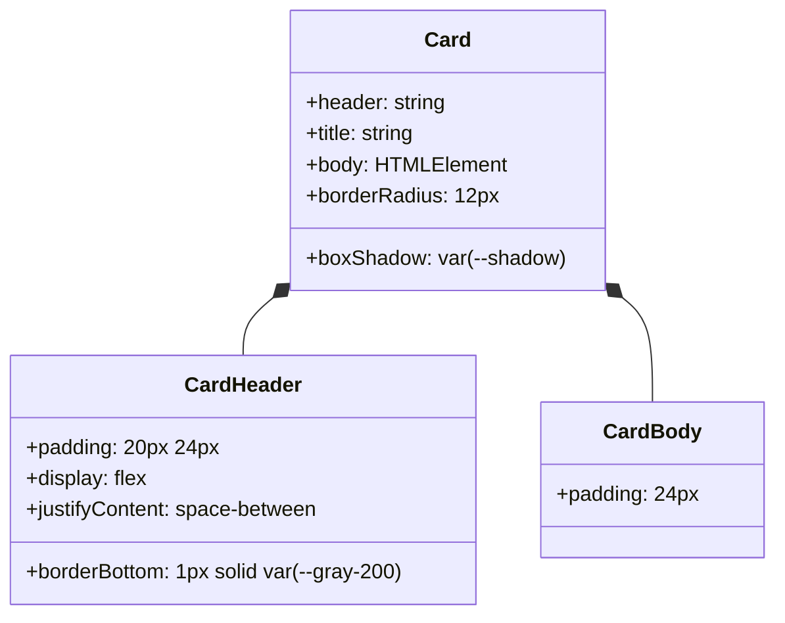
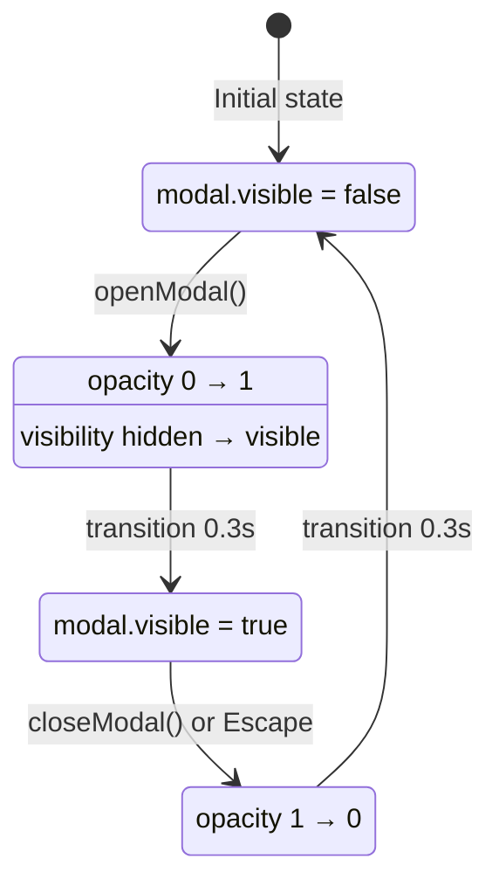
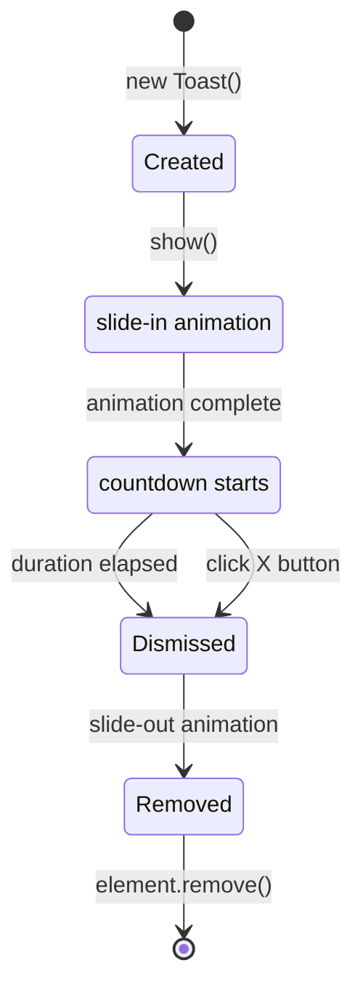
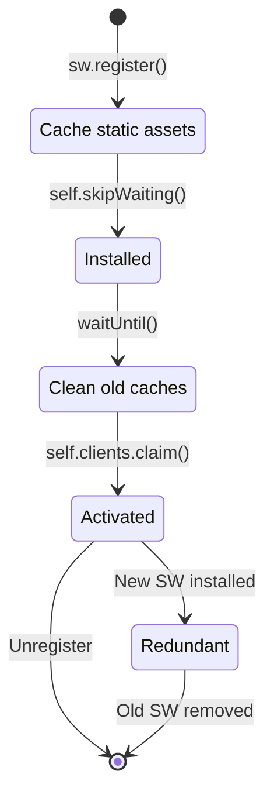

# Microservice Design Specification

> **Technical Reference**: This document provides detailed technical specifications for all microservice components, including interfaces, data contracts, and implementation requirements.

---

## 1. System Architecture

### 1.1 Component Diagram



### 1.2 Technology Stack Matrix

| Component | Technology | Version | Type |
|-----------|------------|---------|------|
| **Presentation** | HTML5 | Living Standard | Markup |
| **Styling** | CSS3 | Level 4 | Stylesheet |
| **Logic** | JavaScript | ES2022 | Programming |
| **Modules** | ES Modules | Native | Import/Export |
| **HTTP Client** | Fetch API | Living Standard | Web API |
| **Crypto** | Web Crypto API | Level 4 | Security |
| **Cache** | Service Worker | v3 | PWA |
| **Storage** | localStorage | Living Standard | Client Storage |
| **Database** | Upstash Redis | Serverless | Cloud DB |
| **CDN** | GitHub Pages | - | Hosting |

---

## 2. Module Specifications

### 2.1 API Module (js/app.js)

#### 2.1.1 Public Interface

```typescript
interface API {
  // Initialization
  init(): Promise<void>;
  
  // Authentication
  register(email: string, password: string, name?: string): Promise<Session>;
  login(email: string, password: string): Promise<Session>;
  logout(): Promise<void>;
  validateSession(): Promise<User | null>;
  
  // Tickets
  createTicket(title: string, description: string, userEmail: string): Promise<number>;
  getTicket(id: number): Promise<Ticket | null>;
  getOpenTickets(): Promise<Ticket[]>;
  getClosedTickets(): Promise<Ticket[]>;
  getUserOpenTickets(email: string): Promise<Ticket[]>;
  getUserClosedTickets(email: string): Promise<Ticket[]>;
  closeTicket(id: number, response: string): Promise<void>;
  
  // Utilities
  getStats(): Promise<Stats>;
  searchTickets(tickets: Ticket[], query: string): Ticket[];
  requireAuth(allowedRoles?: string[]): () => Promise<User | null>;
  
  // Security
  sha256(str: string): Promise<string>;
  hashPassword(password: string): Promise<string>;
  escapeHtml(text: string): string;
  formatDate(timestamp: number): string;
}
```

#### 2.1.2 Data Contracts

```typescript
interface Session {
  token: string;
  user: User;
}

interface User {
  email: string;
  name: string;
  role: 'user' | 'admin';
}

interface Ticket {
  id: number;
  title: string;
  description: string;
  userEmail: string;
  status: 'open' | 'closed';
  createdAt: number;
  response: string;
  responseAt: number;
}

interface Stats {
  openCount: number;
  closedCount: number;
  totalCount: number;
  userCount: number;
}
```

#### 2.1.3 Redis Key Contracts

| Key Pattern | Type | TTL | Description |
|-------------|------|-----|-------------|
| `ticket:counter` | Integer | ∞ | Auto-increment ID |
| `ticket:{id}` | Hash | ∞ | Ticket data |
| `tickets:open` | Sorted Set | ∞ | Open ticket IDs (score: timestamp) |
| `tickets:closed` | Sorted Set | ∞ | Closed ticket IDs (score: timestamp) |
| `tickets:user:{email}:open` | Set | ∞ | User's open ticket IDs |
| `tickets:user:{email}:closed` | Set | ∞ | User's closed ticket IDs |
| `user:{email}` | Hash | ∞ | User data |
| `session:{token}` | Hash | 24h | Session data |

### 2.2 Toast Module (js/toast.js)

#### 2.2.1 Public Interface

```typescript
interface Toast {
  init(): void;
  show(message: string, type?: ToastType, duration?: number): void;
  success(message: string, duration?: number): void;
  error(message: string, duration?: number): void;
  info(message: string, duration?: number): void;
  warning(message: string, duration?: number): void;
}

type ToastType = 'success' | 'error' | 'info' | 'warning';
```

#### 2.2.2 Toast Configuration

| Property | Value | Description |
|----------|-------|-------------|
| **Default Duration** | 4000ms | Auto-dismiss time |
| **Position** | top-right | Fixed positioning |
| **Max Width** | 350px | Container width |
| **Z-Index** | 10000 | Above all content |
| **Animation** | slide-in/out | 300ms transitions |

### 2.3 Service Worker (service-worker.js)

#### 2.3.1 Cache Strategy



#### 2.3.2 Cached Assets

| Asset | Cache Strategy | Update Frequency |
|-------|---------------|------------------|
| `*.html` | Cache-first | On install |
| `*.css` | Cache-first | On install |
| `*.js` | Cache-first | On install |
| `manifest.json` | Cache-first | On install |
| `upstash.io/*` | Network-only | No cache |

---

## 3. Page Specifications

### 3.1 index.html (Dashboard)

#### 3.1.1 Features

| Feature | Description |
|---------|-------------|
| **Statistics Cards** | Open count, closed count, total, users |
| **Quick Actions** | Login button, Create Ticket button |
| **Dynamic Nav** | Shows user info if authenticated |
| **Auto-refresh** | Updates stats every 30 seconds |
| **Session Check** | Redirects authenticated users |

#### 3.1.2 State Management



### 3.2 login.html (Authentication)

#### 3.2.1 Features

| Feature | Description |
|---------|-------------|
| **Tab Interface** | Login / Register toggle |
| **Form Validation** | HTML5 + JavaScript validation |
| **Loading States** | Button spinner during request |
| **Error Handling** | Toast notifications for errors |
| **Auto-redirect** | Redirects if already logged in |

#### 3.2.2 Form Fields

**Login Form:**
| Field | Type | Required | Validation |
|-------|------|----------|------------|
| email | email | Yes | Valid email format |
| password | password | Yes | Min 1 character |

**Register Form:**
| Field | Type | Required | Validation |
|-------|------|----------|------------|
| name | text | No | - |
| email | email | Yes | Valid email format |
| password | password | Yes | Min 4 characters |
| confirm | password | Yes | Must match password |

### 3.3 dashboard.html (User Panel)

#### 3.3.1 Features

| Feature | Description |
|---------|-------------|
| **Two-Column Layout** | Open tickets | Closed tickets |
| **Search per Column** | Real-time filtering |
| **Create Modal** | Ticket creation form |
| **Detail Modal** | View ticket details + responses |
| **Auto-refresh** | Updates every 30 seconds |

#### 3.3.2 Layout Structure

```
┌─────────────────────────────────────────────────────────┐
│                    dashboard.html                        │
├─────────────────────────────────────────────────────────┤
│  ┌─────────────────────┐  ┌─────────────────────────┐  │
│  │   OPEN TICKETS      │  │    CLOSED TICKETS       │  │
│  │   (Column 1)        │  │    (Column 2)            │  │
│  │                     │  │                         │  │
│  │  🔍 Search...       │  │  🔍 Search...           │  │
│  │                     │  │                         │  │
│  │  ┌───────────────┐  │  │  ┌───────────────┐     │  │
│  │  │ #1 Title...   │  │  │  │ #3 Title...   │     │  │
│  │  │ Status: Open  │  │  │  │ Status: Closed│     │  │
│  │  └───────────────┘  │  │  └───────────────┘     │  │
│  │                     │  │                         │  │
│  │  ┌───────────────┐  │  │  ┌───────────────┐     │  │
│  │  │ #2 Title...   │  │  │  │ #5 Title...   │     │  │
│  │  │ Status: Open  │  │  │  │ Status: Closed│     │  │
│  │  └───────────────┘  │  │  └───────────────┘     │  │
│  └─────────────────────┘  └─────────────────────────┘  │
└─────────────────────────────────────────────────────────┘
```

### 3.4 admin.html (Admin Panel)

#### 3.4.1 Features

| Feature | Description |
|---------|-------------|
| **System Stats** | All open, closed, total tickets |
| **Tab Navigation** | Open tickets | Closed tickets |
| **Unified Search** | Search across all tickets |
| **Resolve Modal** | Admin response form |
| **Date Ordering** | Oldest first for open tickets |

#### 3.4.2 Admin Actions

| Action | Redis Operation | UI Response |
|--------|----------------|-------------|
| View open tickets | ZRANGE tickets:open | Render list |
| View closed tickets | ZRANGE tickets:closed | Render list |
| Resolve ticket | HSET + ZADD + ZREM | Move to closed |
| Search tickets | Client-side filter | Highlight matches |

---

## 4. Design System Specifications

### 4.1 Color Palette



### 4.2 Typography Scale

| Element | Font | Size | Weight |
|---------|------|------|--------|
| **H1 (Page Title)** | Inter | 1.75rem | 700 |
| **H2 (Section)** | Inter | 1.125rem | 600 |
| **H3 (Card)** | Inter | 1rem | 600 |
| **Body** | Inter | 14px | 400 |
| **Small** | Inter | 12px | 400 |
| **Caption** | Inter | 11px | 600 |

### 4.3 Spacing System

| Token | Value | Usage |
|-------|-------|-------|
| `--radius` | 8px | Border radius |
| `--shadow` | 0 1px 3px | Card shadow |
| `--shadow-md` | 0 4px 6px | Modal shadow |
| `--shadow-lg` | 0 10px 15px | Dropdown shadow |

---

## 5. Component Specifications

### 5.1 Button Component



### 5.2 Card Component



### 5.3 Modal Component



### 5.4 Toast Component



---

## 6. PWA Specifications

### 6.1 Manifest Schema

```json
{
  "name": "WTicket - Sistema de Tickets",
  "short_name": "WTicket",
  "description": "Sistema de gestión de tickets de soporte",
  "start_url": "/index.html",
  "display": "standalone",
  "background_color": "#f9fafb",
  "theme_color": "#6366f1",
  "orientation": "portrait-primary",
  "icons": [
    {
      "src": "data:image/svg+xml,...svg",
      "sizes": "any",
      "type": "image/svg+xml",
      "purpose": "any maskable"
    }
  ],
  "categories": ["productivity", "business"],
  "lang": "es",
  "dir": "ltr"
}
```

### 6.2 Service Worker Lifecycle



---

*Document Version: 1.0*  
*Last Updated: 2026-03-25*
