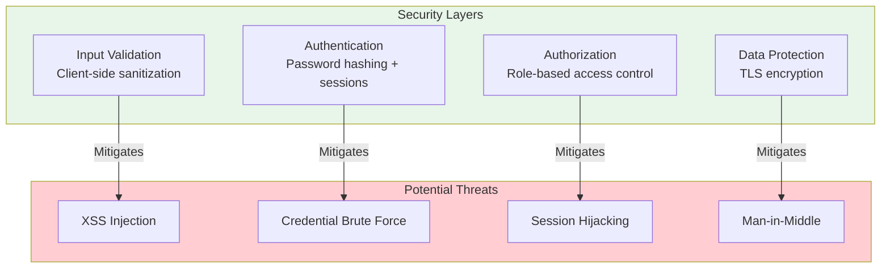
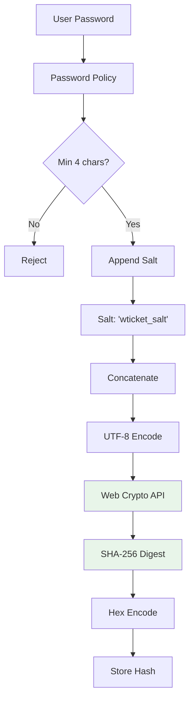
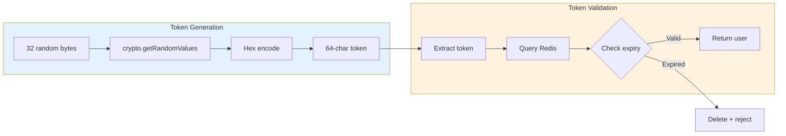
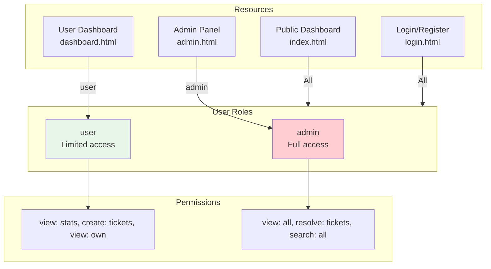
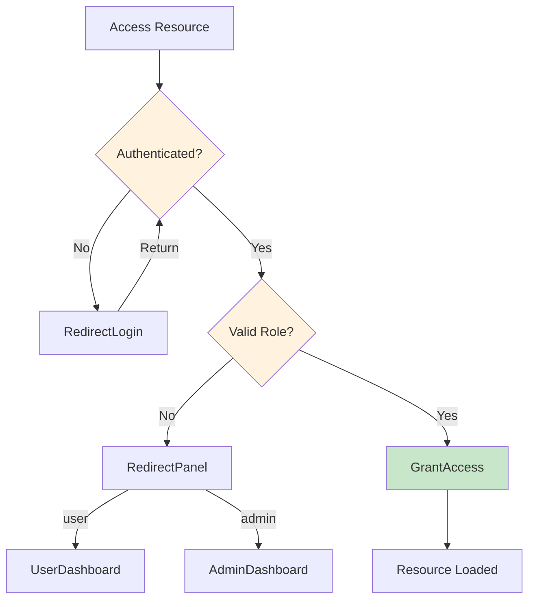
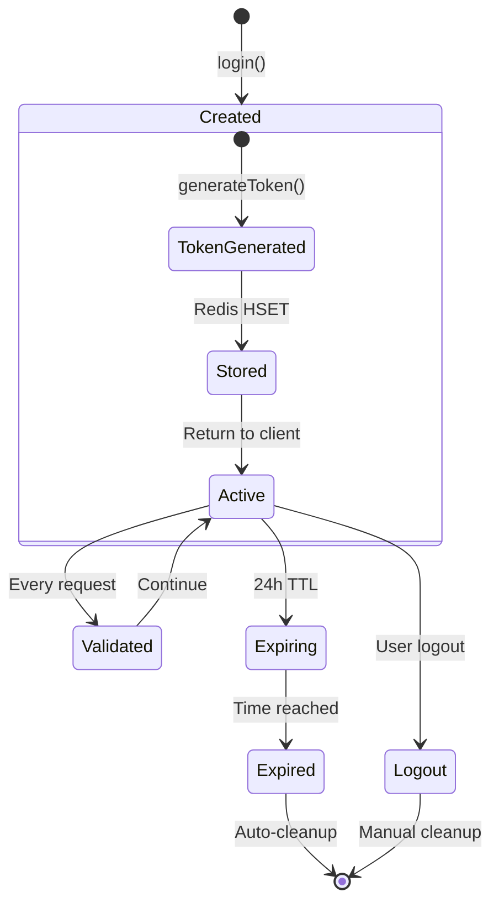
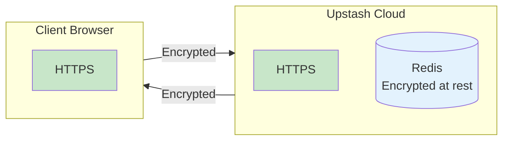
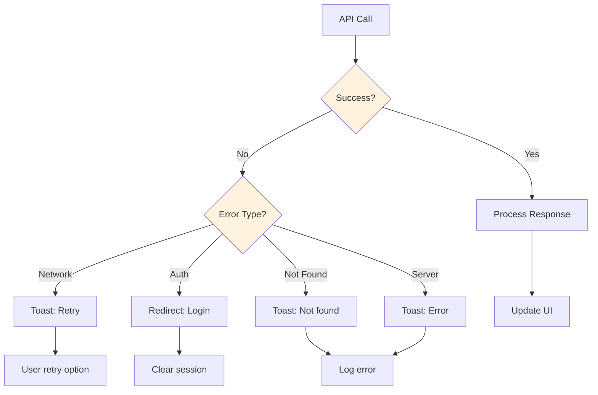
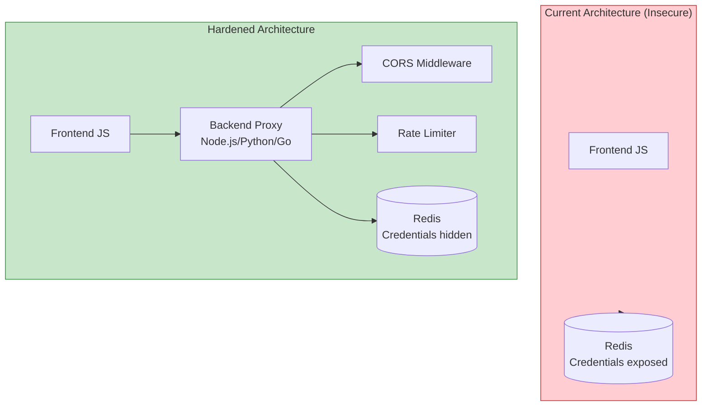

# Security, Hardening & Resiliency Documentation

> **Technical Reference**: This document details security measures, hardening procedures, and resilience patterns implemented in the ticket management microservice.

---

## 1. Security Architecture Overview

### 1.1 Security Layers



### 1.2 Security Controls Matrix

| Control | Type | Implementation | Effectiveness |
|---------|------|---------------|---------------|
| **Input Sanitization** | Preventive | escapeHtml() | High |
| **Password Hashing** | Preventive | SHA-256 + salt | High |
| **Session Tokens** | Preventive | 256-bit crypto | High |
| **Session Expiry** | Detective | 24h TTL | Medium |
| **Role Authorization** | Preventive | requireAuth() | High |
| **TLS Encryption** | Preventive | HTTPS (Upstash) | High |

---

## 2. Authentication Security

### 2.1 Password Security Implementation



### 2.2 Token Security



---

## 3. XSS Protection

### 3.1 Sanitization Flow

```mermaid
flowchart TD
    subgraph Input["User Input"]
        I1[Title]
        I2[Description]
        I3[Response]
    end
    
    subgraph Sanitize["Sanitization"]
        S1[Create div element]
        S2[Set textContent]
        S3[Read innerHTML]
    end
    
    subgraph Storage["Redis Storage"]
        R1[Stored safely]
    end
    
    I1 --> S1
    I2 --> S1
    I3 --> S1
    S1 --> S2 --> S3 --> R1
    
    Note over S1,S3: textContent automatically escapes<br/>HTML entities
    
    style Input fill:#e3f2fd
    style Sanitize fill:#e8f5e9
```

### 3.2 XSS Prevention Examples

| Input | Stored As | Rendered As |
|-------|-----------|-------------|
| `<script>alert(1)</script>` | `&lt;script&gt;alert(1)&lt;/script&gt;` | Plain text |
| `` | Escaped | Plain text |
| `Normal text` | `Normal text` | Normal text |

---

## 4. Authorization Model

### 4.1 Role-Based Access Control



### 4.2 Authorization Flow



---

## 5. Session Management

### 5.1 Session Lifecycle



### 5.2 Session Storage Schema

```
session:{token} Hash
├── email: string       # User email
├── name: string        # Display name
├── role: string        # user | admin
├── createdAt: number   # Creation timestamp
└── expiresAt: number  # Expiry timestamp
    └── TTL: 86400 seconds (24 hours)
```

---

## 6. Network Security

### 6.1 Transport Security

| Layer | Protocol | Protection |
|-------|----------|------------|
| **Browser → Upstash** | HTTPS | TLS 1.3 encryption |
| **Browser → CDN** | HTTPS | TLS 1.3 encryption |
| **API Authentication** | Bearer Token | Token in Authorization header |

### 6.2 Data Flow Security



---

## 7. Resiliency Patterns

### 7.1 Error Handling Flow



### 7.2 Retry Logic

```javascript
// Implemented in auto-refresh
async function withRetry(fn, retries = 3) {
  for (let i = 0; i < retries; i++) {
    try {
      return await fn();
    } catch (error) {
      if (i === retries - 1) throw error;
      await new Promise(r => setTimeout(r, 1000 * (i + 1)));
    }
  }
}
```

---

## 8. Security Hardening Recommendations

### 8.1 Production Hardening Checklist

| Item | Priority | Status |
|------|----------|--------|
| Move Redis credentials to backend | Critical | Pending |
| Implement rate limiting | High | Pending |
| Add CORS restrictions | High | Pending |
| Enable Redis firewall | Medium | Pending |
| Implement audit logging | Medium | Pending |
| Add request signing | Medium | Pending |

### 8.2 Backend Proxy Architecture



### 8.3 Rate Limiting Configuration

```javascript
// Example: Backend rate limiting (pseudocode)
const rateLimit = {
  windowMs: 15 * 60 * 1000, // 15 minutes
  max: 100, // limit each IP to 100 requests per window
  message: "Too many requests"
};
```

---

## 9. Security Logging

### 9.1 Events to Log

| Event | Severity | Data |
|-------|----------|------|
| Failed login | Warning | email, IP, timestamp |
| Successful login | Info | email, role, timestamp |
| Session expired | Info | sessionId, timestamp |
| Ticket created | Debug | ticketId, user, timestamp |
| Ticket resolved | Info | ticketId, admin, timestamp |
| XSS attempt | Critical | input, user, timestamp |

### 9.2 Log Format

```json
{
  "timestamp": "2026-03-25T12:00:00.000Z",
  "level": "warning",
  "event": "failed_login",
  "email": "user@example.com",
  "ip": "192.168.1.1",
  "userAgent": "Mozilla/5.0..."
}
```

---

## 10. Known Limitations

### 10.1 Current Security Limitations

| Limitation | Risk | Mitigation |
|------------|------|------------|
| Token in frontend | Credential exposure | Use for demos only |
| No rate limiting | DoS vulnerability | Deploy backend proxy |
| No server validation | Trust client data | Add backend validation |
| No audit trail | Compliance gap | Implement logging |
| CORS not enforced | Unauthorized access | Configure Upstash CORS |

### 10.2 Security Comparison

| Aspect | Current | Production |
|--------|---------|------------|
| **Credentials** | Exposed in JS | Hidden in backend |
| **Rate Limiting** | None | Redis-based |
| **Input Validation** | Client-side only | Server-side required |
| **Audit Logging** | Console only | Persistent storage |
| **CORS** | Default allow | Explicit whitelist |

---

*Document Version: 1.0*  
*Last Updated: 2026-03-25*
