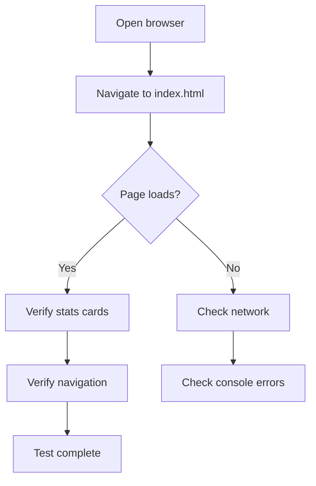
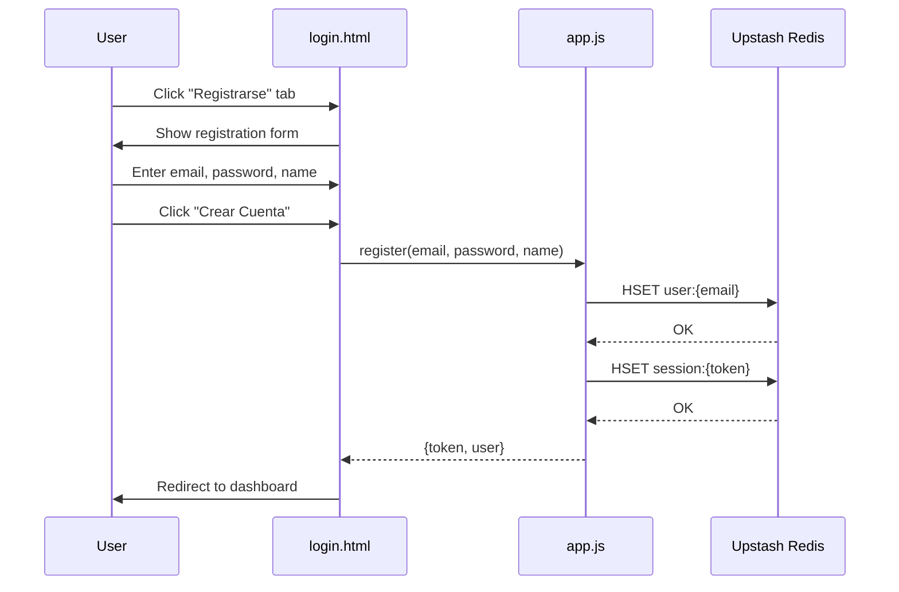
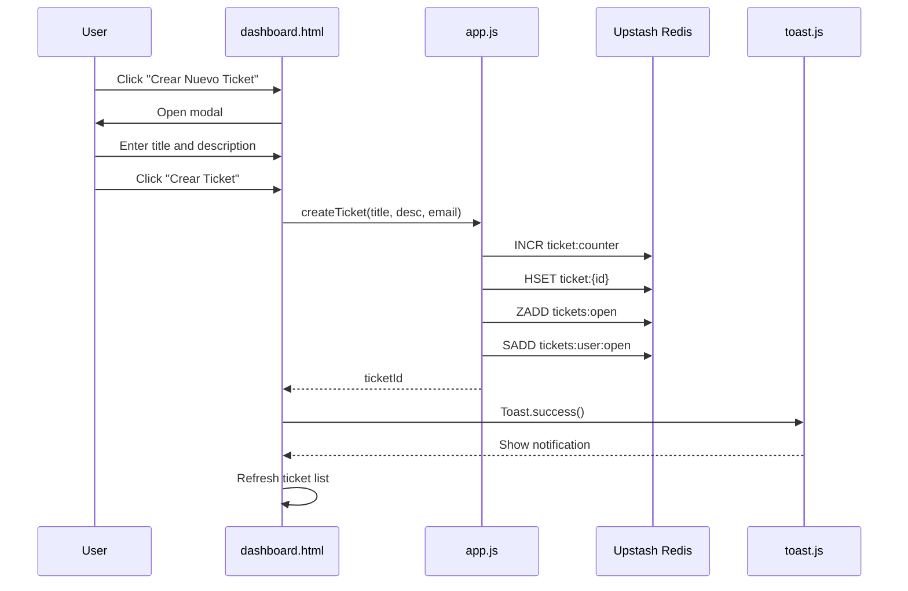
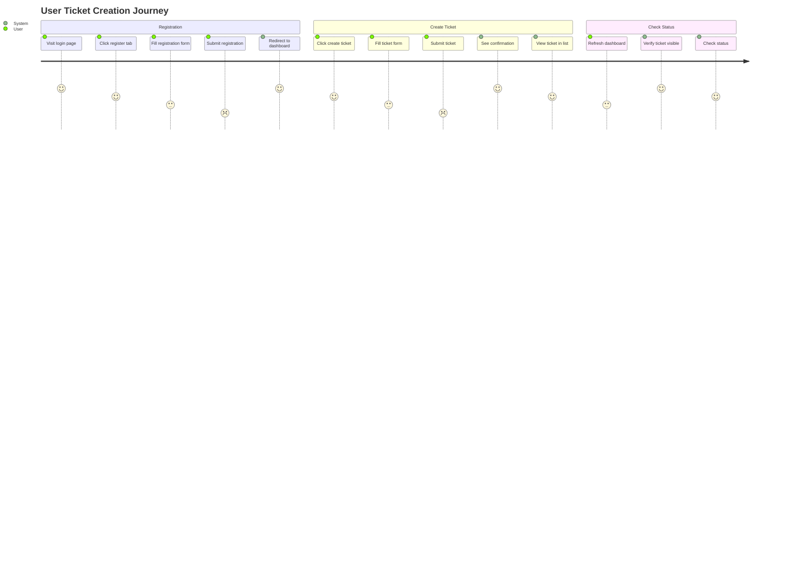
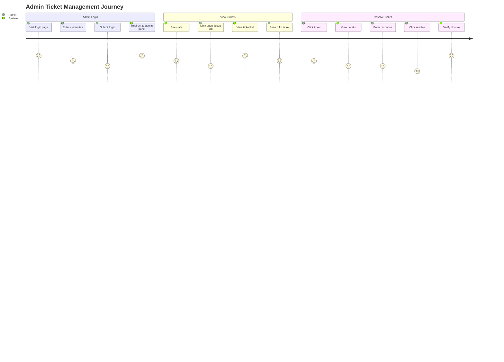
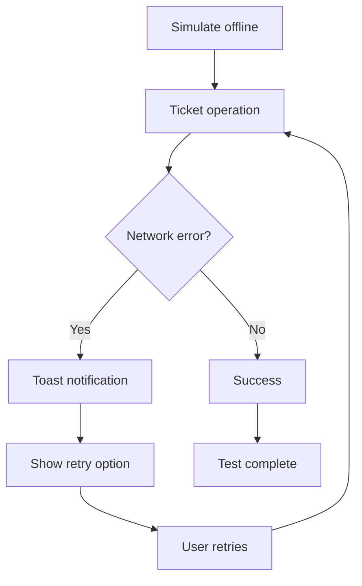

# Usage & Test Documentation

> **Technical Reference**: This document provides comprehensive usage instructions and test documentation with execution evidence.

---

## 1. Quick Start Guide

### 1.1 Prerequisites Verification

| Requirement | Command | Expected Result |
|------------|---------|-----------------|
| Modern Browser | Chrome 90+ / Firefox 88+ | ✅ |
| Internet Connection | Ping test | Latency < 500ms |
| Git (optional) | `git --version` | git version x.x.x |
| Python (optional) | `python3 --version` | Python 3.x.x |

### 1.2 Deployment Methods

#### Method 1: GitHub Pages (Recommended)

```bash
# 1. Clone repository
git clone https://github.com/wisrovi/wticket.git
cd wticket

# 2. Push to your GitHub repository
git remote set-url origin https://github.com/YOUR_USER/YOUR_REPO.git
git push -u origin main

# 3. Enable GitHub Pages
# Repository Settings → Pages → Source: main branch
# Access at: https://YOUR_USER.github.io/YOUR_REPO/
```

#### Method 2: Local Development

```bash
# Using Python
python3 -m http.server 8000
# Access at: http://localhost:8000

# Using Node.js
npx serve .
# Access at: http://localhost:3000

# Using PHP
php -S localhost:8000
# Access at: http://localhost:8000
```

---

## 2. Functionality Testing

### 2.1 Test Matrix

| Test ID | Feature | Expected Result | Status |
|---------|---------|---------------|--------|
| T-001 | Dashboard loads | Statistics visible | ⬜ |
| T-002 | User registration | New user created | ⬜ |
| T-003 | User login | Session established | ⬜ |
| T-004 | Invalid login | Error message shown | ⬜ |
| T-005 | Create ticket | Ticket ID returned | ⬜ |
| T-006 | View my tickets | Tickets displayed | ⬜ |
| T-007 | Search tickets | Results filtered | ⬜ |
| T-008 | Admin login | Admin panel access | ⬜ |
| T-009 | Admin view all | All open tickets shown | ⬜ |
| T-010 | Admin resolve | Ticket closed | ⬜ |
| T-011 | Logout | Session cleared | ⬜ |
| T-012 | Session expiry | Redirect to login | ⬜ |

### 2.2 Step-by-Step Test Procedures

#### Test T-001: Dashboard Load



**Verification Steps:**
1. Open browser DevTools (F12)
2. Navigate to application URL
3. Verify 4 stat cards visible:
   - Tickets Abiertos (yellow)
   - Tickets Atendidos (green)
   - Total de Tickets (orange)
   - Usuarios Registrados (blue)
4. Verify "Iniciar Sesión" link visible
5. Verify "Crear Ticket" button visible

#### Test T-002: User Registration



**Verification Steps:**
1. Click "Registrarse" tab
2. Fill form:
   - Nombre: Test User
   - Email: test@example.com
   - Contraseña: test1234
   - Confirmar: test1234
3. Click "Crear Cuenta"
4. Verify:
   - Toast: "¡Cuenta creada exitosamente!"
   - Redirect to dashboard.html
   - User name in navbar

#### Test T-003: Ticket Creation



**Verification Steps:**
1. Click "Crear Nuevo Ticket" button
2. Enter:
   - Título: "Test Ticket"
   - Descripción: "This is a test ticket"
3. Click "Crear Ticket"
4. Verify:
   - Toast: "Ticket #X creado exitosamente"
   - Ticket appears in Open Tickets column
   - Ticket ID matches returned ID

---

## 3. User Flow Testing

### 3.1 Complete User Journey



### 3.2 Admin Journey



---

## 4. API Endpoint Testing

### 4.1 Upstash Redis Commands

Since this is a serverless frontend architecture, testing involves browser-based API calls:

```javascript
// Test: Create a ticket (execute in browser console)
import API from './js/app.js';

async function testCreateTicket() {
  const session = await API.login('test@example.com', 'test1234');
  console.log('Session:', session);
  
  const ticketId = await API.createTicket(
    'Test Title',
    'Test Description',
    session.user.email
  );
  console.log('Created ticket ID:', ticketId);
  
  return ticketId;
}

testCreateTicket();
```

### 4.2 Expected API Calls

| Operation | Redis Commands | Expected Response |
|-----------|---------------|------------------|
| **Init** | EXISTS user:admin | 0 or 1 |
| **Register** | EXISTS → HSET → HSET | {token, user} |
| **Login** | HGETALL → HSET → EXPIRE | {token, user} |
| **Create Ticket** | INCR → HSET → ZADD → SADD | ticketId (number) |
| **Get Stats** | ZCARD → ZCARD → KEYS | {openCount, ...} |
| **Close Ticket** | HGETALL → HSET → ZADD → ZREM → SADD → SREM | void |

---

## 5. Browser Compatibility Testing

### 5.1 Test Matrix

| Browser | Version | Platform | Status |
|---------|---------|----------|--------|
| Chrome | 120+ | Windows | ⬜ |
| Chrome | 120+ | macOS | ⬜ |
| Chrome | 120+ | Android | ⬜ |
| Firefox | 121+ | Windows | ⬜ |
| Firefox | 121+ | macOS | ⬜ |
| Safari | 17+ | macOS | ⬜ |
| Safari | 17+ | iOS | ⬜ |
| Edge | 120+ | Windows | ⬜ |

### 5.2 Feature Detection

```javascript
// Run in browser console to verify features
const features = {
  'ES Modules': typeof import === 'undefined',
  'Service Worker': 'serviceWorker' in navigator,
  'localStorage': (() => {
    try { localStorage.setItem('test', 'test'); return true; }
    catch (e) { return false; }
  })(),
  'Web Crypto': 'crypto' in window && 'subtle' in crypto,
  'Fetch API': typeof fetch === 'function'
};

console.table(features);
```

---

## 6. Security Testing

### 6.1 XSS Prevention Test

```javascript
// Test: Attempt XSS injection
const maliciousInput = '<script>alert("XSS")</script>';

async function testXSSPrevention() {
  // Create ticket with XSS payload
  const ticketId = await API.createTicket(
    maliciousInput,
    maliciousInput,
    'test@example.com'
  );
  
  // Retrieve ticket
  const ticket = await API.getTicket(ticketId);
  
  // Check if script tags are sanitized
  const isSafe = !ticket.title.includes('<script>');
  console.log('XSS Prevention:', isSafe ? 'PASSED' : 'FAILED');
  
  return isSafe;
}

testXSSPrevention();
```

### 6.2 Session Security Test

```javascript
// Test: Session expiry
async function testSessionExpiry() {
  // Get current session
  const session = await API.validateSession();
  console.log('Session valid:', !!session);
  
  if (session) {
    // Check expiry
    const expiresAt = Date.now() + (24 * 60 * 60 * 1000);
    const isValid = session.expiresAt > Date.now();
    console.log('Session not expired:', isValid);
  }
}

testSessionExpiry();
```

---

## 7. Performance Testing

### 7.1 Load Time Benchmarks

| Metric | Target | Measurement Method |
|--------|--------|-------------------|
| First Contentful Paint | < 1.5s | Chrome DevTools |
| Largest Contentful Paint | < 2.5s | Chrome DevTools |
| Time to Interactive | < 3.5s | Chrome DevTools |
| Redis Response Time | < 200ms | Network tab |

### 7.2 Load Testing Script

```javascript
// Performance test in browser console
const performanceTest = async () => {
  const results = [];
  
  // Test 1: Page load
  const pageStart = performance.now();
  // (Simulate page load)
  const pageLoad = performance.now() - pageStart;
  results.push({ test: 'Page Load', duration: pageLoad });
  
  // Test 2: Redis connection
  const redisStart = performance.now();
  await API.getStats();
  const redisTime = performance.now() - redisStart;
  results.push({ test: 'Redis Stats', duration: redisTime });
  
  // Test 3: Ticket creation
  const createStart = performance.now();
  await API.createTicket('Perf Test', 'Testing', 'test@example.com');
  const createTime = performance.now() - createStart;
  results.push({ test: 'Create Ticket', duration: createTime });
  
  console.table(results);
};

performanceTest();
```

---

## 8. Error Scenario Testing

### 8.1 Network Error Handling



### 8.2 Test Error Scenarios

| Scenario | How to Test | Expected Result |
|----------|-------------|-----------------|
| Network offline | DevTools → Network → Offline | Toast: Network error |
| Invalid email | Enter invalid format | HTML5 validation error |
| Wrong password | Enter wrong password | Toast: Contraseña incorrecta |
| Expired session | Clear localStorage | Redirect to login |
| Ticket not found | Try to access deleted ticket | Toast: Not found |

---

*Document Version: 1.0*  
*Last Updated: 2026-03-25*
